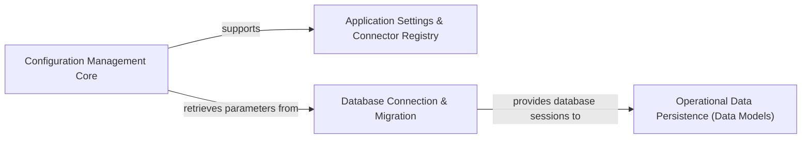

## Component Details

This subsystem is critical for managing all aspects of application configuration, from initial setup and secure handling of sensitive data to the persistent storage and retrieval of operational trading data. It ensures that Hummingbot operates with correct parameters, maintains data integrity, and allows for historical analysis and recovery.

### Configuration Management Core

This component is the foundational layer for Hummingbot's configuration system. It defines the structure of configuration data using Pydantic models, handles the loading and saving of these configurations to and from YAML files, and provides mechanisms for data validation and secure encryption/decryption of sensitive information (e.g., API keys). It ensures that configuration data is consistently structured, validated, and securely managed throughout the application.

**Related Classes/Methods**:

- <a href="https://github.com/hummingbot/hummingbot/blob/master/hummingbot/client/config/config_helpers.py#L0-L0" target="_blank" rel="noopener noreferrer">`hummingbot/client/config/config_helpers.py` (0:0)</a>

- <a href="https://github.com/hummingbot/hummingbot/blob/master/hummingbot/client/config/config_data_types.py#L0-L0" target="_blank" rel="noopener noreferrer">`hummingbot/client/config/config_data_types.py` (0:0)</a>

- <a href="https://github.com/hummingbot/hummingbot/blob/master/hummingbot/client/config/config_validators.py#L0-L0" target="_blank" rel="noopener noreferrer">`hummingbot/client/config/config_validators.py` (0:0)</a>

- <a href="https://github.com/hummingbot/hummingbot/blob/master/hummingbot/client/config/config_crypt.py#L0-L0" target="_blank" rel="noopener noreferrer">`hummingbot/client/config/config_crypt.py` (0:0)</a>

- <a href="https://github.com/hummingbot/hummingbot/blob/master/hummingbot/client/config/security.py#L0-L0" target="_blank" rel="noopener noreferrer">`hummingbot/client/config/security.py` (0:0)</a>

- <a href="https://github.com/hummingbot/hummingbot/blob/master/hummingbot/client/config/config_var.py#L0-L0" target="_blank" rel="noopener noreferrer">`hummingbot/client/config/config_var.py` (0:0)</a>

- <a href="https://github.com/hummingbot/hummingbot/blob/master/hummingbot/client/config/config_methods.py#L0-L0" target="_blank" rel="noopener noreferrer">`hummingbot/client/config/config_methods.py` (0:0)</a>

- <a href="https://github.com/hummingbot/hummingbot/blob/master/hummingbot/client/config/conf_migration.py#L0-L0" target="_blank" rel="noopener noreferrer">`hummingbot/client/config/conf_migration.py` (0:0)</a>

- <a href="https://github.com/hummingbot/hummingbot/blob/master/hummingbot/client/config/trade_fee_schema_loader.py#L0-L0" target="_blank" rel="noopener noreferrer">`hummingbot/client/config/trade_fee_schema_loader.py` (0:0)</a>

### Application Settings & Connector Registry

This component serves as the central, high-level access point for all application-wide settings and dynamically manages configurations for various trading connectors. It provides a consolidated view and interface for other parts of the application to retrieve and interact with the currently loaded and active configurations, including the setup of simulated (paper trading) connector settings.

**Related Classes/Methods**:

- `hummingbot/client/settings/AllConnectorSettings.py` (0:0)

- `hummingbot/client/settings/__init__.py` (0:0)

- <a href="https://github.com/hummingbot/hummingbot/blob/master/hummingbot/client/config/client_config_map.py#L0-L0" target="_blank" rel="noopener noreferrer">`hummingbot/client/config/client_config_map.py` (0:0)</a>

- <a href="https://github.com/hummingbot/hummingbot/blob/master/hummingbot/client/config/global_config_map.py#L0-L0" target="_blank" rel="noopener noreferrer">`hummingbot/client/config/global_config_map.py` (0:0)</a>

- <a href="https://github.com/hummingbot/hummingbot/blob/master/hummingbot/client/config/fee_overrides_config_map.py#L0-L0" target="_blank" rel="noopener noreferrer">`hummingbot/client/config/fee_overrides_config_map.py` (0:0)</a>

- <a href="https://github.com/hummingbot/hummingbot/blob/master/hummingbot/client/config/gateway_ssl_config_map.py#L0-L0" target="_blank" rel="noopener noreferrer">`hummingbot/client/config/gateway_ssl_config_map.py` (0:0)</a>

### Database Connection & Migration

This component is exclusively responsible for establishing and maintaining the connection to the SQLite database used by Hummingbot. It handles the initialization of the SQLAlchemy engine and metadata, and critically, it manages the database schema migration process to ensure compatibility and data integrity across different application versions.

**Related Classes/Methods**:

- <a href="https://github.com/hummingbot/hummingbot/blob/master/hummingbot/model/sql_connection_manager.py#L0-L0" target="_blank" rel="noopener noreferrer">`hummingbot/model/sql_connection_manager.py` (0:0)</a>

- <a href="https://github.com/hummingbot/hummingbot/blob/master/hummingbot/model/db_migration/migrator.py#L0-L0" target="_blank" rel="noopener noreferrer">`hummingbot/model/db_migration/migrator.py` (0:0)</a>

- <a href="https://github.com/hummingbot/hummingbot/blob/master/hummingbot/model/db_migration/base_transformation.py#L0-L0" target="_blank" rel="noopener noreferrer">`hummingbot/model/db_migration/base_transformation.py` (0:0)</a>

- <a href="https://github.com/hummingbot/hummingbot/blob/master/hummingbot/model/db_migration/transformations.py#L0-L0" target="_blank" rel="noopener noreferrer">`hummingbot/model/db_migration/transformations.py` (0:0)</a>

- <a href="https://github.com/hummingbot/hummingbot/blob/master/hummingbot/model/metadata.py#L0-L0" target="_blank" rel="noopener noreferrer">`hummingbot/model/metadata.py` (0:0)</a>

### Operational Data Persistence (Data Models)

This component defines the SQLAlchemy models that represent the various operational data points persisted to the SQLite database. These models facilitate the mapping of Python objects to database tables, enabling the storage and retrieval of critical information such as trade fills, order history, market states, and strategy-specific data. This data is essential for reporting, performance analysis, and strategy recovery.

**Related Classes/Methods**:

- <a href="https://github.com/hummingbot/hummingbot/blob/master/hummingbot/model/trade_fill.py#L0-L0" target="_blank" rel="noopener noreferrer">`hummingbot/model/trade_fill.py` (0:0)</a>

- <a href="https://github.com/hummingbot/hummingbot/blob/master/hummingbot/model/order.py#L0-L0" target="_blank" rel="noopener noreferrer">`hummingbot/model/order.py` (0:0)</a>

- <a href="https://github.com/hummingbot/hummingbot/blob/master/hummingbot/model/order_status.py#L0-L0" target="_blank" rel="noopener noreferrer">`hummingbot/model/order_status.py` (0:0)</a>

- <a href="https://github.com/hummingbot/hummingbot/blob/master/hummingbot/model/position.py#L0-L0" target="_blank" rel="noopener noreferrer">`hummingbot/model/position.py` (0:0)</a>

- <a href="https://github.com/hummingbot/hummingbot/blob/master/hummingbot/model/inventory_cost.py#L0-L0" target="_blank" rel="noopener noreferrer">`hummingbot/model/inventory_cost.py` (0:0)</a>

- <a href="https://github.com/hummingbot/hummingbot/blob/master/hummingbot/model/market_data.py#L0-L0" target="_blank" rel="noopener noreferrer">`hummingbot/model/market_data.py` (0:0)</a>

- <a href="https://github.com/hummingbot/hummingbot/blob/master/hummingbot/model/funding_payment.py#L0-L0" target="_blank" rel="noopener noreferrer">`hummingbot/model/funding_payment.py` (0:0)</a>

- <a href="https://github.com/hummingbot/hummingbot/blob/master/hummingbot/model/range_position_collected_fees.py#L0-L0" target="_blank" rel="noopener noreferrer">`hummingbot/model/range_position_collected_fees.py` (0:0)</a>

- <a href="https://github.com/hummingbot/hummingbot/blob/master/hummingbot/model/range_position_update.py#L0-L0" target="_blank" rel="noopener noreferrer">`hummingbot/model/range_position_update.py` (0:0)</a>

- <a href="https://github.com/hummingbot/hummingbot/blob/master/hummingbot/model/decimal_type_decorator.py#L0-L0" target="_blank" rel="noopener noreferrer">`hummingbot/model/decimal_type_decorator.py` (0:0)</a>

- <a href="https://github.com/hummingbot/hummingbot/blob/master/hummingbot/model/transaction_base.py#L0-L0" target="_blank" rel="noopener noreferrer">`hummingbot/model/transaction_base.py` (0:0)</a>

- <a href="https://github.com/hummingbot/hummingbot/blob/master/hummingbot/model/controllers.py#L0-L0" target="_blank" rel="noopener noreferrer">`hummingbot/model/controllers.py` (0:0)</a>

- <a href="https://github.com/hummingbot/hummingbot/blob/master/hummingbot/model/executors.py#L0-L0" target="_blank" rel="noopener noreferrer">`hummingbot/model/executors.py` (0:0)</a>

### [FAQ](https://github.com/CodeBoarding/GeneratedOnBoardings/tree/main?tab=readme-ov-file#faq)