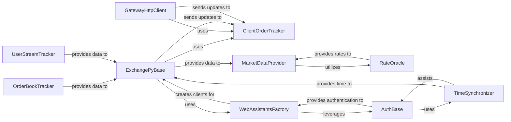

## Component Details

This subsystem is crucial for Hummingbot's ability to interact with various cryptocurrency exchanges, both centralized and decentralized. It handles the entire lifecycle of trading operations, from placing orders to receiving real-time market data and managing account balances.

### ExchangePyBase

This is the foundational abstract base class for all Python-based exchange connectors. It defines the common interface and core functionalities for interacting with cryptocurrency exchanges, including order placement, cancellation, balance updates, and trading rule management. It acts as the blueprint that all specific exchange implementations extend.

**Related Classes/Methods**:

- <a href="https://github.com/hummingbot/hummingbot/blob/master/hummingbot/connector/exchange_py_base.py#L39-L1096" target="_blank" rel="noopener noreferrer">`ExchangePyBase` (39:1096)</a>

### GatewayHttpClient

This component facilitates communication with the Hummingbot Gateway service, which acts as a bridge to decentralized exchanges (DEXs) and other blockchain-based protocols. It handles API requests, status checks, and configuration updates for all Gateway-connected operations, abstracting away blockchain complexities.

**Related Classes/Methods**:

- <a href="https://github.com/hummingbot/hummingbot/blob/master/hummingbot/core/gateway/gateway_http_client.py#L44-L781" target="_blank" rel="noopener noreferrer">`GatewayHttpClient` (44:781)</a>

### ClientOrderTracker

This is a central component responsible for managing the complete lifecycle of client orders. It tracks the status of orders from submission to completion, processes updates (e.g., partial fills, cancellations), and handles state restoration. It serves as a crucial hub for all order-related events.

**Related Classes/Methods**:

- <a href="https://github.com/hummingbot/hummingbot/blob/master/hummingbot/connector/client_order_tracker.py#L31-L444" target="_blank" rel="noopener noreferrer">`ClientOrderTracker` (31:444)</a>

### MarketDataProvider

This component provides a unified and abstracted interface for accessing various types of market data, including order books, trades, and candles, from different connectors. It simplifies data retrieval for trading strategies by abstracting away the specific API details of individual exchanges or data sources.

**Related Classes/Methods**:

- <a href="https://github.com/hummingbot/hummingbot/blob/master/hummingbot/data_feed/market_data_provider.py#L27-L382" target="_blank" rel="noopener noreferrer">`MarketDataProvider` (27:382)</a>

### RateOracle

The `RateOracle` is responsible for fetching and providing real-time exchange rate conversions between different cryptocurrency assets. It aggregates price data from various sources to calculate accurate and up-to-date conversion rates, which are essential for multi-asset strategies.

**Related Classes/Methods**:

- <a href="https://github.com/hummingbot/hummingbot/blob/master/hummingbot/core/rate_oracle/rate_oracle.py#L44-L216" target="_blank" rel="noopener noreferrer">`RateOracle` (44:216)</a>

### WebAssistantsFactory

This is a factory class responsible for creating and managing web communication clients, including both REST and WebSocket clients, for interacting with external exchange APIs. It centralizes the process of setting up authenticated and throttled web clients.

**Related Classes/Methods**:

- <a href="https://github.com/hummingbot/hummingbot/blob/master/hummingbot/core/web_assistant/web_assistants_factory.py#L13-L80" target="_blank" rel="noopener noreferrer">`WebAssistantsFactory` (13:80)</a>

### AuthBase

This is an abstract base class that defines the interface for authentication mechanisms used to sign requests to exchange APIs. Concrete implementations handle specific cryptographic signing algorithms and secure management of API credentials.

**Related Classes/Methods**:

- `AuthBase` (0:0)

### OrderBookTracker

This component is responsible for maintaining a real-time, consolidated, and accurate view of market order books. It continuously processes updates received from data sources, ensuring that strategies and other parts of the system always have access to the most current market depth information.

**Related Classes/Methods**:

- <a href="https://github.com/hummingbot/hummingbot/blob/master/hummingbot/core/data_type/order_book_tracker.py#L23-L344" target="_blank" rel="noopener noreferrer">`OrderBookTracker` (23:344)</a>

### UserStreamTracker

This component is responsible for maintaining a real-time, consolidated, and accurate view of user-specific data, such as account balances and open orders. It continuously processes updates from user data streams, ensuring that the bot has the most current information about its trading account.

**Related Classes/Methods**:

- <a href="https://github.com/hummingbot/hummingbot/blob/master/hummingbot/core/data_type/user_stream_tracker.py#L9-L39" target="_blank" rel="noopener noreferrer">`UserStreamTracker` (9:39)</a>

### TimeSynchronizer

This component is crucial for ensuring that the bot's internal system clock is accurately synchronized with the server time of external exchanges. This synchronization is vital for precise timestamping of orders and trades, and for fulfilling exchange API requirements that often involve time-based signatures.

**Related Classes/Methods**:

- <a href="https://github.com/hummingbot/hummingbot/blob/master/hummingbot/connector/time_synchronizer.py#L11-L95" target="_blank" rel="noopener noreferrer">`TimeSynchronizer` (11:95)</a>

### [FAQ](https://github.com/CodeBoarding/GeneratedOnBoardings/tree/main?tab=readme-ov-file#faq)