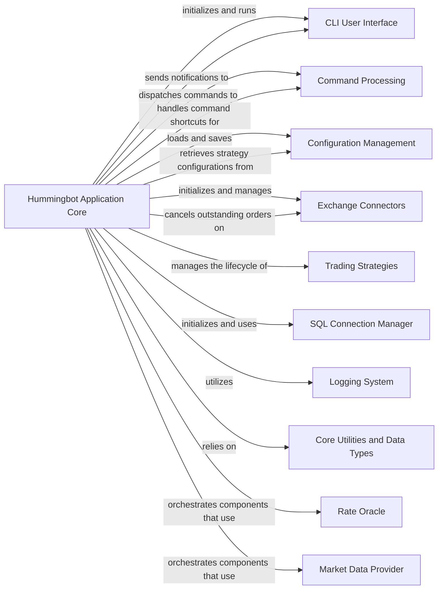

## Component Details

Analysis of the Hummingbot Application Core component, its role, and its relationships with other key components within the Hummingbot client.

### Hummingbot Application Core

The Hummingbot Application Core is the central orchestrator of the Hummingbot client. It is responsible for initializing and managing all other core services, processing user commands, loading configurations, and overseeing the execution of trading strategies. It acts as the main event loop and the glue holding the entire application together.

**Related Classes/Methods**:

- <a href="https://github.com/hummingbot/hummingbot/blob/master/hummingbot/client/hummingbot_application.py#L1-L1" target="_blank" rel="noopener noreferrer">`hummingbot.client.hummingbot_application` (1:1)</a>

- `HummingbotCLI` (1:1)

- `HummingbotCLI:run` (1:1)

- <a href="https://github.com/hummingbot/hummingbot/blob/master/hummingbot/client/hummingbot_application.py#L177-L180" target="_blank" rel="noopener noreferrer">`HummingbotApplication:notify` (177:180)</a>

- `HummingbotCLI:log` (1:1)

- <a href="https://github.com/hummingbot/hummingbot/blob/master/hummingbot/client/hummingbot_application.py#L212-L250" target="_blank" rel="noopener noreferrer">`HummingbotApplication:_handle_command` (212:250)</a>

- <a href="https://github.com/hummingbot/hummingbot/blob/master/hummingbot/client/hummingbot_application.py#L182-L210" target="_blank" rel="noopener noreferrer">`HummingbotApplication:_handle_shortcut` (182:210)</a>

- `load_client_config_map_from_file` (1:1)

- `load_ssl_config_map_from_file` (1:1)

- `save_client_config` (1:1)

- `get_strategy_config_map` (1:1)

- <a href="https://github.com/hummingbot/hummingbot/blob/master/hummingbot/client/hummingbot_application.py#L291-L331" target="_blank" rel="noopener noreferrer">`HummingbotApplication:_initialize_markets` (291:331)</a>

- `ExchangeBase` (1:1)

- `ExchangeBase:cancel_all` (1:1)

- `strategy` (1:1)

- `strategy_task` (1:1)

- `SQLConnectionManager:get_trade_fills_instance` (1:1)

- <a href="https://github.com/hummingbot/hummingbot/blob/master/hummingbot/connector/markets_recorder.py#L53-L592" target="_blank" rel="noopener noreferrer">`MarketsRecorder` (53:592)</a>

- <a href="https://github.com/hummingbot/hummingbot/blob/master/hummingbot/client/hummingbot_application.py#L58-L62" target="_blank" rel="noopener noreferrer">`HummingbotApplication:logger` (58:62)</a>

- `notifiers` (1:1)

- `asyncio` (1:1)

- `ClientConfigAdapter` (1:1)

- `ExchangeBase` (1:1)

- `StrategyBase` (1:1)

- <a href="https://github.com/hummingbot/hummingbot/blob/master/hummingbot/client/hummingbot_application.py#L1-L1" target="_blank" rel="noopener noreferrer">`HummingbotApplication:data_feed` (1:1)</a>

### CLI User Interface

**Related Classes/Methods**: _None_

### Command Processing

**Related Classes/Methods**: _None_

### Configuration Management

**Related Classes/Methods**: _None_

### Exchange Connectors

**Related Classes/Methods**: _None_

### Trading Strategies

**Related Classes/Methods**: _None_

### SQL Connection Manager

**Related Classes/Methods**: _None_

### Logging System

**Related Classes/Methods**: _None_

### Core Utilities and Data Types

**Related Classes/Methods**: _None_

### Rate Oracle

**Related Classes/Methods**: _None_

### Market Data Provider

**Related Classes/Methods**: _None_

### [FAQ](https://github.com/CodeBoarding/GeneratedOnBoardings/tree/main?tab=readme-ov-file#faq)