```mermaid

graph LR

    ScriptStrategyBase["ScriptStrategyBase"]

    StrategyV2Base["StrategyV2Base"]

    ControllerBase["ControllerBase"]

    ExecutorBase["ExecutorBase"]

    ExecutorOrchestrator["ExecutorOrchestrator"]

    MarketDataProvider["MarketDataProvider"]

    BacktestingEngineBase["BacktestingEngineBase"]

    BacktestingDataProvider["BacktestingDataProvider"]

    PositionExecutor["PositionExecutor"]

    ConnectorBase["ConnectorBase"]

    StrategyV2Base -- "extends" --> ScriptStrategyBase

    ExecutorBase -- "relies on" --> ScriptStrategyBase

    StrategyV2Base -- "relies on" --> MarketDataProvider

    StrategyV2Base -- "uses" --> ControllerBase

    StrategyV2Base -- "uses" --> ExecutorOrchestrator

    ControllerBase -- "receives data from" --> MarketDataProvider

    ControllerBase -- "sends actions to" --> ExecutorOrchestrator

    ExecutorBase -- "interacts with" --> ScriptStrategyBase

    ExecutorOrchestrator -- "manages" --> ExecutorBase

    ExecutorOrchestrator -- "receives actions from" --> ControllerBase

    ExecutorOrchestrator -- "interacts with" --> StrategyV2Base

    MarketDataProvider -- "provides data to" --> StrategyV2Base

    MarketDataProvider -- "provides data to" --> ControllerBase

    MarketDataProvider -- "relies on" --> ConnectorBase

    BacktestingEngineBase -- "relies on" --> BacktestingDataProvider

    BacktestingEngineBase -- "interacts with" --> ControllerBase

    BacktestingDataProvider -- "extends" --> MarketDataProvider

    BacktestingDataProvider -- "provides data to" --> BacktestingEngineBase

    PositionExecutor -- "extends" --> ExecutorBase

    PositionExecutor -- "interacts with" --> ConnectorBase

    ScriptStrategyBase -- "interacts with" --> ConnectorBase

    ExecutorBase -- "interacts with" --> ConnectorBase

```

## Component Details

The Strategy Execution Engine is the core of Hummingbot's automated trading capabilities, responsible for defining, executing, and backtesting trading strategies. It has evolved to support both legacy monolithic strategies and a more modular V2 framework.

### ScriptStrategyBase

The foundational abstract class for all trading strategies in Hummingbot. It provides essential functionalities for interacting with exchanges, including placing and canceling orders, retrieving market information, and managing account balances. It serves as the base for both traditional and modular V2 strategies.

**Related Classes/Methods**:

- <a href="https://github.com/hummingbot/hummingbot/blob/master/hummingbot/strategy/script_strategy_base.py#L27-L255" target="_blank" rel="noopener noreferrer">`ScriptStrategyBase` (27:255)</a>

### StrategyV2Base

The core abstract class for the modular V2 strategy framework. It extends `ScriptStrategyBase` and orchestrates the overall lifecycle of V2 strategies. Its responsibilities include managing market data provision, initializing and updating strategy controllers, and coordinating the actions of executors through the `ExecutorOrchestrator`.

**Related Classes/Methods**:

- <a href="https://github.com/hummingbot/hummingbot/blob/master/hummingbot/strategy/strategy_v2_base.py#L161-L499" target="_blank" rel="noopener noreferrer">`StrategyV2Base` (161:499)</a>

### ControllerBase

An abstract base class for V2 strategy controllers. Controllers encapsulate the high-level trading logic, analyze market conditions using data from the `MarketDataProvider`, and propose trading actions (e.g., creating or stopping executors) to the `ExecutorOrchestrator` to achieve strategy goals.

**Related Classes/Methods**:

- <a href="https://github.com/hummingbot/hummingbot/blob/master/hummingbot/strategy_v2/controllers/controller_base.py#L128-L207" target="_blank" rel="noopener noreferrer">`ControllerBase` (128:207)</a>

### ExecutorBase

An abstract base class for V2 strategy executors. Executors represent atomic trading operations, handling the low-level details of order placement, tracking, and reporting by interacting with the underlying connectors via `ScriptStrategyBase`. Concrete executors (like `PositionExecutor`) implement specific trading patterns.

**Related Classes/Methods**:

- <a href="https://github.com/hummingbot/hummingbot/blob/master/hummingbot/strategy_v2/executors/executor_base.py#L28-L416" target="_blank" rel="noopener noreferrer">`ExecutorBase` (28:416)</a>

### ExecutorOrchestrator

A central component within the V2 strategy framework responsible for managing the lifecycle and execution of various `ExecutorBase` instances. It receives proposed actions from `ControllerBase` instances, creates and monitors executors, and aggregates their status and performance. It also handles the persistence of executor and position data.

**Related Classes/Methods**:

- <a href="https://github.com/hummingbot/hummingbot/blob/master/hummingbot/strategy_v2/executors/executor_orchestrator.py#L133-L608" target="_blank" rel="noopener noreferrer">`ExecutorOrchestrator` (133:608)</a>

### MarketDataProvider

Responsible for providing real-time and historical market data (e.g., candles, order book snapshots, prices) to strategies and controllers. It abstracts the complexities of data acquisition from various `ConnectorBase` instances, ensuring a consistent data interface for the trading logic.

**Related Classes/Methods**:

- <a href="https://github.com/hummingbot/hummingbot/blob/master/hummingbot/data_feed/market_data_provider.py#L27-L382" target="_blank" rel="noopener noreferrer">`MarketDataProvider` (27:382)</a>

### BacktestingEngineBase

Provides the core framework for backtesting V2 strategies. It simulates market conditions and processes strategy logic over historical data, evaluating the performance of executors in a simulated environment without live market interaction.

**Related Classes/Methods**:

- <a href="https://github.com/hummingbot/hummingbot/blob/master/hummingbot/strategy_v2/backtesting/backtesting_engine_base.py#L31-L330" target="_blank" rel="noopener noreferrer">`BacktestingEngineBase` (31:330)</a>

### BacktestingDataProvider

A specialized data provider for the backtesting engine. It extends `MarketDataProvider` and is responsible for loading and serving historical market data, mimicking real-time data feeds for simulation purposes. It ensures that backtests operate on consistent and accurate historical data.

**Related Classes/Methods**:

- <a href="https://github.com/hummingbot/hummingbot/blob/master/hummingbot/strategy_v2/backtesting/backtesting_data_provider.py#L21-L185" target="_blank" rel="noopener noreferrer">`BacktestingDataProvider` (21:185)</a>

### PositionExecutor

A concrete implementation of `ExecutorBase` designed to manage and execute a single trading position. It handles the entire lifecycle of opening and closing a position, including advanced features like stop-loss, take-profit, and trailing stop functionalities, by interacting directly with the configured connector.

**Related Classes/Methods**:

- <a href="https://github.com/hummingbot/hummingbot/blob/master/hummingbot/strategy_v2/executors/position_executor/position_executor.py#L25-L802" target="_blank" rel="noopener noreferrer">`PositionExecutor` (25:802)</a>

### ConnectorBase

Represents the abstract interface for interacting with various cryptocurrency exchanges and decentralized protocols. It provides essential methods for placing orders, fetching market data (order books, prices, balances), and managing account information. It is a critical dependency for `MarketDataProvider` and `ScriptStrategyBase` (and thus `ExecutorBase`), enabling actual trading operations.

**Related Classes/Methods**:

- `ConnectorBase` (0:0)

### [FAQ](https://github.com/CodeBoarding/GeneratedOnBoardings/tree/main?tab=readme-ov-file#faq)