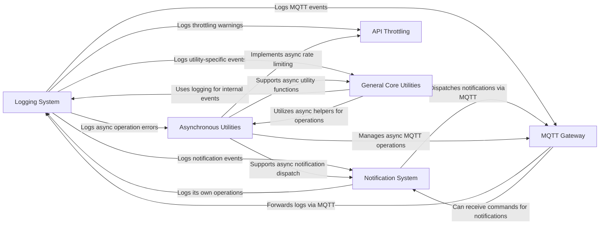

## Component Details

The System Utilities & Monitoring subsystem provides essential cross-cutting functionalities for the application's operation, debugging, and external monitoring. It encompasses a centralized logging system, flexible notification dispatch, robust asynchronous programming helpers, API rate limiting mechanisms, and other common utilities crucial for the stable and observable operation of Hummingbot.

### Logging System

Provides a centralized and flexible logging infrastructure for the entire Hummingbot application. It handles the capture, formatting, and output of various log messages, including standard operational logs, network-specific events, and critical application warnings. This system is vital for debugging, auditing, and monitoring the bot's behavior.

**Related Classes/Methods**:

- <a href="https://github.com/hummingbot/hummingbot/blob/master/hummingbot/logger/logger.py#L1-L1" target="_blank" rel="noopener noreferrer">`hummingbot.logger.logger` (1:1)</a>

### Notification System

Manages and dispatches various types of notifications to the user (e.g., CLI) or integrated external systems (e.g., MQTT). It provides a flexible and extensible way to communicate important events, alerts, and status updates beyond standard logging.

**Related Classes/Methods**:

- <a href="https://github.com/hummingbot/hummingbot/blob/master/hummingbot/notifier/notifier_base.py#L1-L1" target="_blank" rel="noopener noreferrer">`hummingbot.notifier.notifier_base` (1:1)</a>

- <a href="https://github.com/hummingbot/hummingbot/blob/master/hummingbot/client/hummingbot_application.py#L1-L1" target="_blank" rel="noopener noreferrer">`hummingbot.client.hummingbot_application` (1:1)</a>

### MQTT Gateway

Establishes and manages the MQTT (Message Queuing Telemetry Transport) interface, enabling remote control, external monitoring, and real-time event forwarding for the Hummingbot application. It orchestrates various MQTT-related sub-components to broadcast logs, notifications, status updates, and market events, and to receive commands.

**Related Classes/Methods**:

- <a href="https://github.com/hummingbot/hummingbot/blob/master/hummingbot/remote_iface/mqtt.py#L1-L1" target="_blank" rel="noopener noreferrer">`hummingbot.remote_iface.mqtt` (1:1)</a>

### API Throttling

Implements mechanisms to manage and enforce rate limits for API requests made to external exchanges and services. This component is crucial for preventing excessive API calls that could lead to temporary bans, request rejections, or other service disruptions, thereby ensuring stable and compliant operation.

**Related Classes/Methods**:

- <a href="https://github.com/hummingbot/hummingbot/blob/master/hummingbot/core/api_throttler/async_throttler.py#L1-L1" target="_blank" rel="noopener noreferrer">`hummingbot.core.api_throttler.async_throttler` (1:1)</a>

### Asynchronous Utilities

Provides a set of core utility functions and classes designed to facilitate asynchronous programming patterns throughout the application. This includes safe scheduling of coroutines, retry mechanisms for transient failures, and other helpers essential for managing concurrent operations in an event-driven environment.

**Related Classes/Methods**:

- <a href="https://github.com/hummingbot/hummingbot/blob/master/hummingbot/core/utils/async_utils.py#L1-L1" target="_blank" rel="noopener noreferrer">`hummingbot.core.utils.async_utils` (1:1)</a>

### General Core Utilities

A collection of diverse utility modules providing common, reusable functionalities that are not specific to a single domain but are broadly applicable across the application. This includes helpers for managing SSL certificates for secure connections, generating unique tracking nonces for requests, and implementing emergency stop mechanisms.

**Related Classes/Methods**:

- <a href="https://github.com/hummingbot/hummingbot/blob/master/hummingbot/core/utils/ssl_cert.py#L1-L1" target="_blank" rel="noopener noreferrer">`hummingbot.core.utils.ssl_cert` (1:1)</a>

- <a href="https://github.com/hummingbot/hummingbot/blob/master/hummingbot/core/utils/tracking_nonce.py#L1-L1" target="_blank" rel="noopener noreferrer">`hummingbot.core.utils.tracking_nonce` (1:1)</a>

- <a href="https://github.com/hummingbot/hummingbot/blob/master/hummingbot/core/utils/kill_switch.py#L1-L1" target="_blank" rel="noopener noreferrer">`hummingbot.core.utils.kill_switch` (1:1)</a>

### [FAQ](https://github.com/CodeBoarding/GeneratedOnBoardings/tree/main?tab=readme-ov-file#faq)