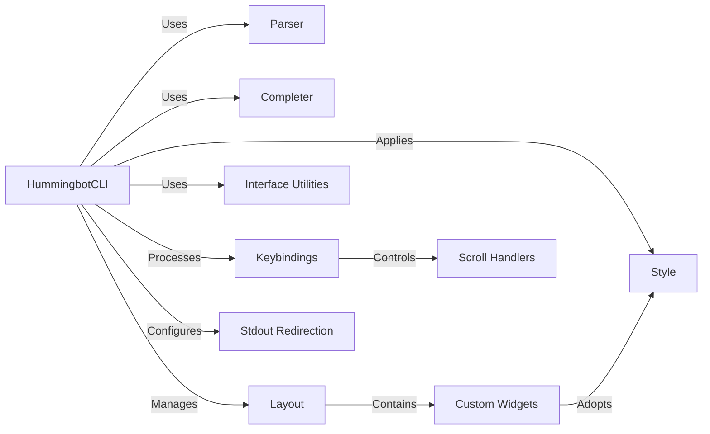

## Component Details

Overview of the User Interface (CLI) subsystem in Hummingbot

### HummingbotCLI

The central orchestrator of the CLI. It initializes the user interface, manages input and output loops, dispatches user commands, and integrates all other UI components. It's the main loop that keeps the CLI running and responsive.

**Related Classes/Methods**:

- <a href="https://github.com/hummingbot/hummingbot/blob/master/hummingbot/client/ui/hummingbot_cli.py#L1-L1" target="_blank" rel="noopener noreferrer">`hummingbot/client/ui/hummingbot_cli.py` (1:1)</a>

### Parser

Responsible for interpreting and validating user commands entered into the CLI. It translates raw text input into structured commands that the application's command handlers can process, ensuring that user input is correctly understood.

**Related Classes/Methods**:

- <a href="https://github.com/hummingbot/hummingbot/blob/master/hummingbot/client/ui/parser.py#L1-L1" target="_blank" rel="noopener noreferrer">`hummingbot/client/ui/parser.py` (1:1)</a>

### Completer

Enhances user experience by providing intelligent auto-completion suggestions for commands, parameters, and configuration values as the user types. This significantly reduces typing effort and potential errors.

**Related Classes/Methods**:

- <a href="https://github.com/hummingbot/hummingbot/blob/master/hummingbot/client/ui/completer.py#L1-L1" target="_blank" rel="noopener noreferrer">`hummingbot/client/ui/completer.py` (1:1)</a>

### Layout

Defines the visual structure and arrangement of different display areas within the CLI, such as the input prompt, log panel, and status panel. It ensures an organized and readable presentation of information.

**Related Classes/Methods**:

- <a href="https://github.com/hummingbot/hummingbot/blob/master/hummingbot/client/ui/layout.py#L1-L1" target="_blank" rel="noopener noreferrer">`hummingbot/client/ui/layout.py` (1:1)</a>

### Custom Widgets

Provides reusable, specialized graphical elements for the CLI, such as tables, progress bars, or formatted text areas. These are used to present complex information effectively within the text-based interface.

**Related Classes/Methods**:

- <a href="https://github.com/hummingbot/hummingbot/blob/master/hummingbot/client/ui/custom_widgets.py#L1-L1" target="_blank" rel="noopener noreferrer">`hummingbot/client/ui/custom_widgets.py` (1:1)</a>

### Interface Utilities

A collection of helper functions for common UI tasks, such as formatting output, displaying messages, and handling user prompts. It ensures consistent presentation and interaction across the CLI.

**Related Classes/Methods**:

- <a href="https://github.com/hummingbot/hummingbot/blob/master/hummingbot/client/ui/interface_utils.py#L1-L1" target="_blank" rel="noopener noreferrer">`hummingbot/client/ui/interface_utils.py` (1:1)</a>

### Style

Manages the visual theme of the CLI, including color schemes, text styles, and other aesthetic properties. It ensures a consistent and user-friendly appearance.

**Related Classes/Methods**:

- <a href="https://github.com/hummingbot/hummingbot/blob/master/hummingbot/client/ui/style.py#L1-L1" target="_blank" rel="noopener noreferrer">`hummingbot/client/ui/style.py` (1:1)</a>

### Keybindings

Defines and manages keyboard shortcuts for various actions within the CLI, enabling efficient navigation and interaction without relying solely on command input.

**Related Classes/Methods**:

- <a href="https://github.com/hummingbot/hummingbot/blob/master/hummingbot/client/ui/keybindings.py#L1-L1" target="_blank" rel="noopener noreferrer">`hummingbot/client/ui/keybindings.py` (1:1)</a>

### Stdout Redirection

A mechanism to capture and redirect standard output (e.g., print statements, logging messages) to specific panels or areas within the CLI's graphical layout, ensuring all relevant information is displayed correctly within the structured UI.

**Related Classes/Methods**:

- <a href="https://github.com/hummingbot/hummingbot/blob/master/hummingbot/client/ui/stdout_redirection.py#L1-L1" target="_blank" rel="noopener noreferrer">`hummingbot/client/ui/stdout_redirection.py` (1:1)</a>

### Scroll Handlers

Manages the scrolling behavior within different panels of the CLI, allowing users to view extensive logs or data outputs that exceed the visible screen area.

**Related Classes/Methods**:

- <a href="https://github.com/hummingbot/hummingbot/blob/master/hummingbot/client/ui/scroll_handlers.py#L1-L1" target="_blank" rel="noopener noreferrer">`hummingbot/client/ui/scroll_handlers.py` (1:1)</a>

### [FAQ](https://github.com/CodeBoarding/GeneratedOnBoardings/tree/main?tab=readme-ov-file#faq)