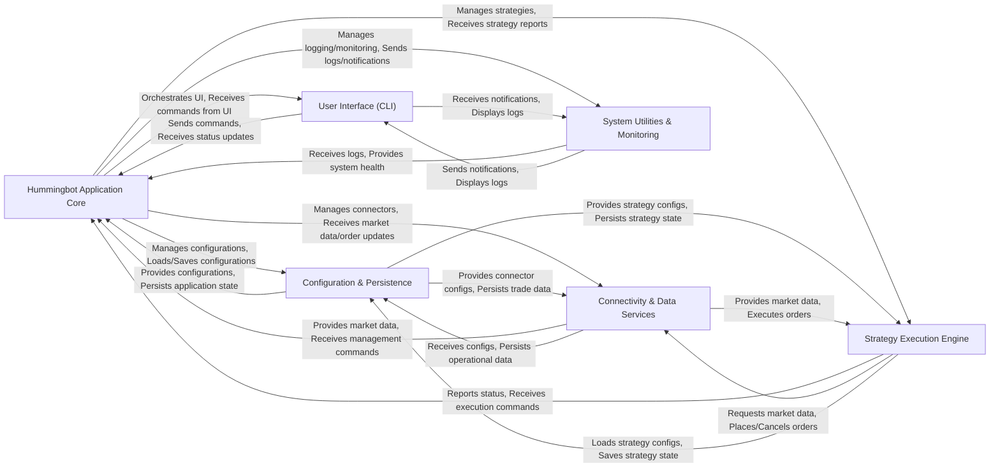

## Component Details

The architecture of Hummingbot can be effectively understood through six fundamental components, each with distinct responsibilities and clear interactions. These components are chosen for their critical roles in the application's lifecycle, from initialization and user interaction to core trading logic and external connectivity.

### Hummingbot Application Core

The central orchestrator of the Hummingbot client. It initializes and manages all other core services, processes user commands, loads configurations, and oversees the execution of trading strategies. It acts as the main loop and the glue holding the entire application together.

**Related Classes/Methods**:

- <a href="https://github.com/hummingbot/hummingbot/blob/master/hummingbot/client/hummingbot_application.py#L50-L349" target="_blank" rel="noopener noreferrer">`hummingbot.client.hummingbot_application.HummingbotApplication` (50:349)</a>

### User Interface (CLI)

Provides the interactive command-line interface through which users control Hummingbot, configure strategies, and view real-time status, logs, and performance metrics. It's the primary human-machine interface.

**Related Classes/Methods**:

- <a href="https://github.com/hummingbot/hummingbot/blob/master/hummingbot/client/ui/hummingbot_cli.py#L51-L276" target="_blank" rel="noopener noreferrer">`hummingbot.client.ui.hummingbot_cli.HummingbotCLI` (51:276)</a>

### Configuration & Persistence

Manages the loading, saving, validation, and secure handling of all application and strategy configurations. This includes sensitive data such as API keys. It also handles the persistence of operational data (e.g., trade fills, order history, strategy states) to the SQLite database, enabling reporting and recovery.

**Related Classes/Methods**:

- <a href="https://github.com/hummingbot/hummingbot/blob/master/hummingbot/client/config/config_helpers.py#L1-L1" target="_blank" rel="noopener noreferrer">`hummingbot.client.config.config_helpers` (1:1)</a>

- <a href="https://github.com/hummingbot/hummingbot/blob/master/hummingbot/model/sql_connection_manager.py#L24-L131" target="_blank" rel="noopener noreferrer">`hummingbot.model.sql_connection_manager.SQLConnectionManager` (24:131)</a>

### Connectivity & Data Services

Abstracts interactions with various external cryptocurrency exchanges (centralized and decentralized via the Hummingbot Gateway service). This component is responsible for handling order placement, cancellation, balance updates, and streaming raw market data (order books, trades, candles). It also includes the Rate Oracle for real-time asset conversion rates and the Order Tracker for managing the lifecycle of in-flight orders.

**Related Classes/Methods**:

- <a href="https://github.com/hummingbot/hummingbot/blob/master/hummingbot/connector/exchange_py_base.py#L39-L1096" target="_blank" rel="noopener noreferrer">`hummingbot.connector.exchange_py_base.ExchangePyBase` (39:1096)</a>

- <a href="https://github.com/hummingbot/hummingbot/blob/master/hummingbot/connector/derivative/binance_perpetual/binance_perpetual_derivative.py#L1-L1" target="_blank" rel="noopener noreferrer">`hummingbot.connector.derivative.binance_perpetual.binance_perpetual_derivative` (1:1)</a>

- <a href="https://github.com/hummingbot/hummingbot/blob/master/hummingbot/core/gateway/gateway_http_client.py#L44-L781" target="_blank" rel="noopener noreferrer">`hummingbot.core.gateway.gateway_http_client.GatewayHttpClient` (44:781)</a>

- <a href="https://github.com/hummingbot/hummingbot/blob/master/hummingbot/connector/client_order_tracker.py#L31-L444" target="_blank" rel="noopener noreferrer">`hummingbot.connector.client_order_tracker.ClientOrderTracker` (31:444)</a>

- <a href="https://github.com/hummingbot/hummingbot/blob/master/hummingbot/data_feed/market_data_provider.py#L27-L382" target="_blank" rel="noopener noreferrer">`hummingbot.data_feed.market_data_provider.MarketDataProvider` (27:382)</a>

- <a href="https://github.com/hummingbot/hummingbot/blob/master/hummingbot/core/rate_oracle/rate_oracle.py#L44-L216" target="_blank" rel="noopener noreferrer">`hummingbot.core.rate_oracle.rate_oracle.RateOracle` (44:216)</a>

### Strategy Execution Engine

The core component for defining, executing, and backtesting automated trading strategies. It encompasses both the legacy monolithic strategies and the newer, more modular V2 strategies (composed of Controllers and Executors). It defines the core logic for how the bot makes trading decisions based on market data and manages order placement through the Connectivity & Data Services.

**Related Classes/Methods**:

- <a href="https://github.com/hummingbot/hummingbot/blob/master/hummingbot/strategy/script_strategy_base.py#L27-L255" target="_blank" rel="noopener noreferrer">`hummingbot.strategy.script_strategy_base.ScriptStrategyBase` (27:255)</a>

- <a href="https://github.com/hummingbot/hummingbot/blob/master/hummingbot/strategy/strategy_v2_base.py#L161-L499" target="_blank" rel="noopener noreferrer">`hummingbot.strategy.strategy_v2_base.StrategyV2Base` (161:499)</a>

- <a href="https://github.com/hummingbot/hummingbot/blob/master/hummingbot/strategy_v2/backtesting/backtesting_engine_base.py#L1-L1" target="_blank" rel="noopener noreferrer">`hummingbot.strategy_v2.backtesting.backtesting_engine_base` (1:1)</a>

### System Utilities & Monitoring

Provides cross-cutting functionalities essential for the application's operation, debugging, and external monitoring. This includes a centralized logging system, notification dispatch (e.g., to CLI, MQTT), asynchronous programming helpers, API rate limiting mechanisms, and other common utilities used across the application.

**Related Classes/Methods**:

- <a href="https://github.com/hummingbot/hummingbot/blob/master/hummingbot/logger/logger.py#L30-L105" target="_blank" rel="noopener noreferrer">`hummingbot.logger.logger.HummingbotLogger` (30:105)</a>

- <a href="https://github.com/hummingbot/hummingbot/blob/master/hummingbot/remote_iface/mqtt.py#L574-L870" target="_blank" rel="noopener noreferrer">`hummingbot.remote_iface.mqtt.MQTTGateway` (574:870)</a>

- <a href="https://github.com/hummingbot/hummingbot/blob/master/hummingbot/core/utils/async_utils.py#L1-L1" target="_blank" rel="noopener noreferrer">`hummingbot.core.utils.async_utils` (1:1)</a>

- <a href="https://github.com/hummingbot/hummingbot/blob/master/hummingbot/core/api_throttler/async_throttler.py#L1-L1" target="_blank" rel="noopener noreferrer">`hummingbot.core.api_throttler.async_throttler` (1:1)</a>

### [FAQ](https://github.com/CodeBoarding/GeneratedOnBoardings/tree/main?tab=readme-ov-file#faq)