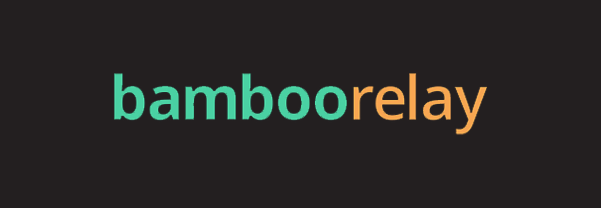
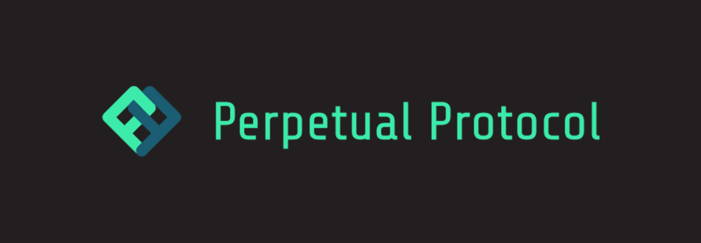

----

Hummingbot is an open-source project that integrates cryptocurrency trading on both **centralized exchanges** and **decentralized protocols**. It allows users to run a client that executes customized, automated trading strategies for cryptocurrencies.

We created hummingbot to promote **decentralized market-making**: enabling members of the community to contribute to the liquidity and trading efficiency in cryptocurrency markets.

## Connector status

 GREEN - Connector is working properly and safe to use

 YELLOW - Connector is either new or has one or more issues

 RED - Connector is broken and unusable

| logo | id | name | ver | doc | status |
|:---:|:---:|:---:|:---:|:---:|:---:|
|  | ascend_ex | [AscendEx](https://ascendex.com/en/global-digital-asset-platform) | 1 | [API](https://ascendex.github.io/ascendex-pro-api/#ascendex-pro-api-documentation) |  |
|  | beaxy | [Beaxy](https://beaxy.com/) | 2 | [API](https://beaxyapiv2trading.docs.apiary.io/) ||
|  | binance | [Binance](https://www.binance.com/) | 3 | [API](https://github.com/binance/binance-spot-api-docs/blob/master/rest-api.md) | | 
|  | binance_us | [Binance US](https://www.binance.com/) | 3 | [API](https://github.com/binance-us/binance-official-api-docs/blob/master/rest-api.md) | |
|  | binance_perpetual | [Binance Futures](https://www.binance.com/) | 1 | [API](https://binance-docs.github.io/apidocs/futures/en/) | |
|| bittrex | [Bittrex Global](https://global.bittrex.com/) | 3 | [API](https://bittrex.github.io/api/v3) | |
|  | bitfinex | [Bitfinex](https://www.bitfinex.com/) | 2 | [API](https://docs.bitfinex.com/docs/introduction) |  |
|  | blocktane | [Blocktane](https://blocktane.io/) | 2 | [API](https://blocktane.io/api) |  |
|  | coinbase_pro | [Coinbase Pro](https://pro.coinbase.com/) | * | [API](https://docs.pro.coinbase.com/) | |
|  | coinzoom | [CoinZoom](https://trade.coinzoom.com/landing) | * | [API](https://api-docs.coinzoom.com/) | |
|  | crypto_com | [Crypto.com](https://crypto.com/exchange) | 2 | [API](https://exchange-docs.crypto.com/#introduction) | |
|  | digifinex | [Digifinex](https://www.digifinex.com/en-ww) | 3 | [API](https://docs.digifinex.com/en-ww/v3/#introduction) | |
|  | dydx | [dYdX](https://dydx.exchange/) | 1 | [API](https://legacy-docs.dydx.exchange/#introduction) | |
|  | dydx_perpetual | [dYdX Perpetual](https://dydx.exchange/) | 3 | [API](https://docs.dydx.exchange/#general) | |
|  | ftx | [FTX](https://ftx.com/en) | 1 | [API](https://docs.ftx.com/#overview) | |
|  | himalaya | [Himalaya Exchange](https://himalaya.exchange/) | * | [API]() | |
|  | hitbtc | [HitBTC](https://hitbtc.com/) | 2 | [API](https://api.hitbtc.com/) |  |
|| huobi | [Huobi Global](https://www.hbg.com) | 1 | [API](https://huobiapi.github.io/docs/spot/v1/en/) | |
|  | gate_io | [Gate.io](https://www.gate.io/) | 2 | [API](https://www.gate.io/api2) |  |
|  | kucoin | [KuCoin](https://www.kucoin.com/) | 1 | [API](https://docs.kucoin.com/#general) | |
|  | kraken | [Kraken](https://www.kraken.com/) | 1 | [API](https://www.kraken.com/features/api) | |
|  | liquid | [Liquid](https://www.liquid.com/) | 2 | [API](https://developers.liquid.com/) | |
|  | ndax | [NDAX](https://ndax.io/) | 1 | [API](https://ndaxlo.github.io/API/) | |
|  | okex | [OKEx](https://www.okex.com/) | 3 | [API](https://www.okex.com/docs/en/) | |
|  | probit | [Probit Global](https://www.probit.com/en-us/) | 1 | [API](https://docs-en.probit.com/docs) | |
|  | probit_kr | [Probit Korea](https://www.probit.kr/en-us/) | 1 | [API](https://docs-en.probit.com/docs) | |

## Supported decentralized exchanges

| logo | id | name | ver | doc| maintainer | status |
|:---:|:---:|:---:|:---:|:---:|:---:|:---:|
|  | bamboo_relay | [Bamboo Relay](https://bamboorelay.com/) | 3 | [API](https://sra.bamboorelay.com/) | [dex@bamboorelay.com](mailto:dex@bamboorelay.com) |  |
|| dolomite | [Dolomite](https://dolomite.io/) | 1 | [API](https://docs.dolomite.io/) | [corey@dolomite.io](mailto:corey@dolomite.io) |  |
|  | radar_relay | [Radar Relay](https://radarrelay.com/) | 2 | [API](https://developers.radarrelay.com/api/trade-api) | |  |
|  | loopring | [Loopring](https://loopring.io/) | 3 | [API](https://docs3.loopring.io/en/) | |  |

## Supported protocol exchanges
| logo | id | name | ver | doc| status |
|:---:|:---:|:---:|:---:|:---:|:--:|
|  | celo | [Celo](https://celo.org/) | * | [SDK](https://celo.org/developers) |  |
|  | balancer | [Balancer](https://balancer.finance/) | * | [SDK](https://docs.balancer.finance/) |  |
|  | perpetual_finance | [Perpetual Protocol](https://perp.fi/) | * | [SDK](https://docs.perp.fi/) |  |
|  | terra | [Terra](https://terra.money/) | * | [SDK](https://docs.terra.money/) |  |
|  | uniswap | [Uniswap](https://uniswap.org/) | 2 | [SDK](https://uniswap.org/docs/v2/) |  |
|  | uniswap v3 | [Uniswap v3](https://uniswap.org/) | 2 | [SDK](https://uniswap.org/blog/uniswap-v3/) |  |

## Getting Started

### Learn more about Hummingbot

- [Website](https://hummingbot.io)
- [Documentation](https://docs.hummingbot.io)
- [FAQs](https://hummingbot.zendesk.com/hc/en-us/categories/900001272063-Hummingbot-FAQs)

### Install Hummingbot

- [Quickstart guide](https://hummingbot.io/academy/quickstart/)
- [All installation options](https://docs.hummingbot.io/installation/overview/)
- [Installation scripts](./installation/)

### Get support
- Chat with our support team on [Discord](https://discord.hummingbot.io)
- Email us at support@hummingbot.io

### Chat with other traders
- Join our community on [Discord](https://discord.coinalpha.com) or [Reddit](https://www.reddit.com/r/Hummingbot/)
- Follow Hummingbot on [Twitter](https://twitter.com/hummingbot_io)

## Contributions

We welcome contributions from the community:
- **Code and documentation contributions** via [pull requests](https://github.com/CoinAlpha/hummingbot/pulls)
- **Bug reports and feature requests** through [Github issues](https://github.com/CoinAlpha/hummingbot/issues)
- When contributing, please review the [contributing guidelines](CONTRIBUTING.md)

## About us

Hummingbot was created and is maintained by CoinAlpha, Inc. We are [a global team of engineers and traders](https://hummingbot.io/about/).

- **General**: contact us at [dev@hummingbot.io](mailto:dev@hummingbot.io) or join our [Discord server](https://discord.hummingbot.io).
- **Business inquiries**: contact us at [partnerships@hummingbot.io](mailto:partnerships@hummingbot.io).

## Legal

- **License**: Hummingbot is licensed under [Apache 2.0](./LICENSE).
- **Data collection**: read important information regarding [Hummingbot Data Collection](DATA_COLLECTION.md).
