----

Hummingbot is an open source client-side framework that helps you build, manage, and run automated trading strategies, or **bots**. This code is free and publicly available under the Apache 2.0 open source license!

### [Docs](https://hummingbot.org/docs/) · [Install](https://hummingbot.org/installation/) · [FAQ](https://hummingbot.org/faq/) ·  [Developers](https://hummingbot.org/developers/) · [CEX Connectors](#centralized-exchange-connectors) · [DEX Connectors](#decentralized-exchange-connectors)

## Why Hummingbot?

* **CEX and DEX connectors**: Hummingbot supports connectors to 30+ centralized exchanges and 7+ decentralized exchanges
* **Advanced market making strategies**: Hummingbot ships with 10+ customizable strategy templates like [Cross-Exchange Market Making](https://hummingbot.org/strategies/cross-exchange-market-making/), [Avellaneda Market Making](https://hummingbot.org/strategies/avellaneda-market-making/) (based on the classic [Avellaneda & Stoikov paper](https://people.orie.cornell.edu/sfs33/LimitOrderBook.pdf)), and [Spot Perpetual Arbitrage](https://hummingbot.org/strategies/spot-perpetual-arbitrage/)
* **Secure local client**: Hummingbot is a local client software that you install and run on your own devices or cloud virtual machines. It encrypts your API keys and private keys and never exposes them to any third parties.
* **Community-driven**: Inspired by Linux, Hummingbot is managed by a not-for-profit foundation that enables the community to govern how the codebase evolves, using the Hummingbot Governance Token (HBOT).

Help us **democratize high-frequency trading** and make powerful trading algorithms accessible to everyone in the world!

## Certified Cryptocurrency Exchanges

[Hummingbot's Exchange Certification](https://hummingbot.org/maintenance/certification/) program is a community-driven process that selects certain exchanges in the Hummingbot codebase to be certified. Certified exchanges are clearly differentiated from non-certified exchanges in the Hummingbot client and documentation, get developer bounties to fund bug fixes and improvements, priority support, and other benefits.

| logo                                                                           | name                                                                      |                                           docs (by connector type)                                           |                                                                 certified                                                                 | signup code                                                                                                                                        |
|--------------------------------------------------------------------------------|---------------------------------------------------------------------------|:------------------------------------------------------------------------------------------------------------:|:-----------------------------------------------------------------------------------------------------------------------------------------:|----------------------------------------------------------------------------------------------------------------------------------------------------|
| 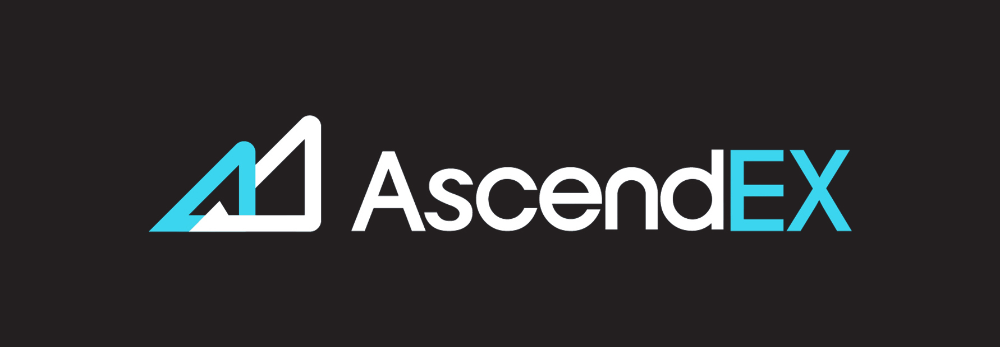               | [AscendEx](https://ascendex.com/register?inviteCode=UEIXNXKW)             |                             [spot](https://hummingbot.org/exchanges/ascend-ex/)                              |  | [UEIXNXKW](https://ascendex.com/register?inviteCode=UEIXNXKW)         |
| 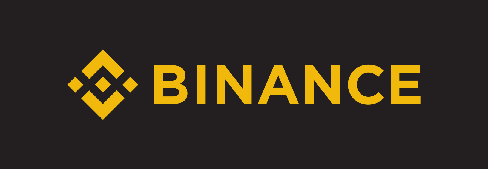                 | [Binance](https://www.binance.com/en/register?ref=FQQNNGCD)               |                              [spot](https://hummingbot.org/exchanges/binance/)                               |  | [FQQNNGCD](https://www.binance.com/en/register?ref=FQQNNGCD)                                                                                       |
| 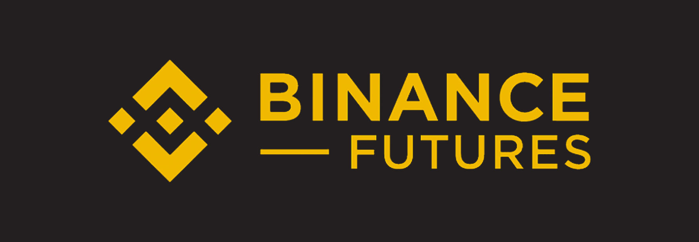 | [Binance Futures](https://www.binance.com/en/futures/ref?code=hummingbot) |                         [perps](https://hummingbot.org/exchanges/binance-perpetual/)                         |  | [hummingbot](https://www.binance.com/en/futures/ref?code=hummingbot)  |
| 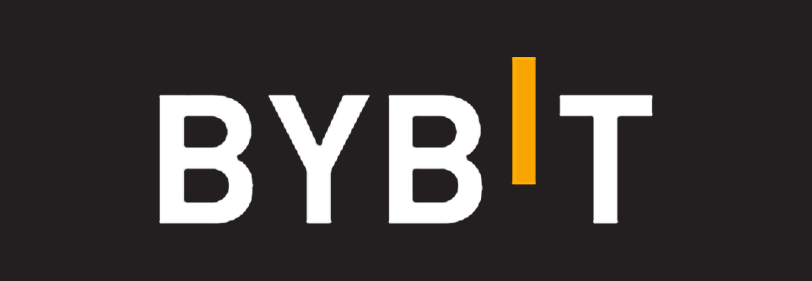                     | [Bybit](https://www.bybit.com/)                                           | [spot](https://hummingbot.org/exchanges/bybit/) / [perps](https://hummingbot.org/exchanges/bybit-perpetual/) |  |                                                                                                                                                    |
|                  | [Gate.io](https://www.gate.io/signup/5868285)                             |                              [spot](https://hummingbot.org/exchanges/gate-io/)                               |  | [5868285](https://www.gate.io/signup/5868285)                         |
| 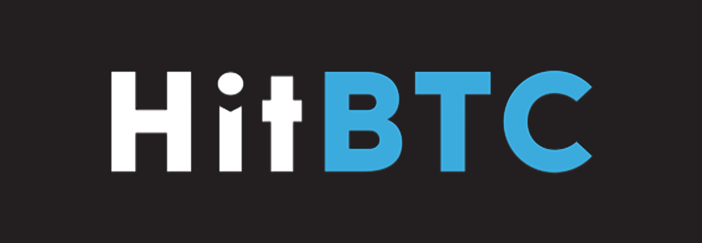                   | [HitBTC](https://hitbtc.com/)                                             |                               [spot](https://hummingbot.org/exchanges/hitbtc/)                               |  |                                                                                                                                                    |
| 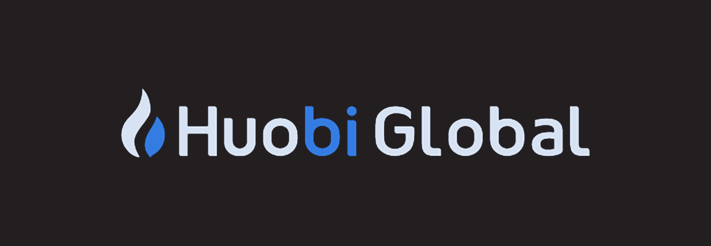       | [Huobi Global](https://www.huobi.com/register/?invite_code=en9k2223)      |                               [spot](https://hummingbot.org/exchanges/huobi/)                                |  | [en9k2223](https://www.huobi.com/register/?invite_code=en9k2223)                                                                                   |
| 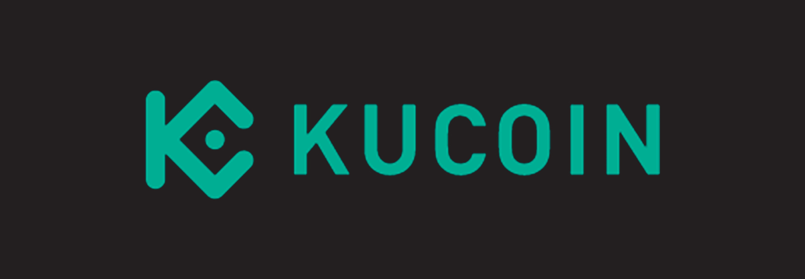                   | [KuCoin](https://www.kucoin.com/ucenter/signup?rcode=272KvRf)             |                               [spot](https://hummingbot.org/exchanges/kucoin/)                               |  | [272KvRf](https://www.kucoin.com/ucenter/signup?rcode=272KvRf)                                                                                     |
| 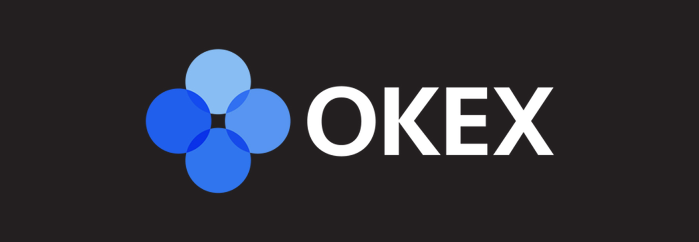                       | [OKX](https://www.okx.com/join/1931920)                                   |                                [spot](https://hummingbot.org/exchanges/okx/)                                 |  | [1931920](https://www.okx.com/join/1931920)                           |

## Supported Centralized Exchange Connectors

| logo                                                                                     | name                                                                      |                                              docs (by connector type)                                              |                                                                 certified                                                                 | signup code                                                                                                                                        |
|------------------------------------------------------------------------------------------|---------------------------------------------------------------------------|:------------------------------------------------------------------------------------------------------------------:|:-----------------------------------------------------------------------------------------------------------------------------------------:|----------------------------------------------------------------------------------------------------------------------------------------------------|
|                  | [AltMarkets.io](https://altmarkets.io/)                                   |                                [spot](https://hummingbot.org/exchanges/altmarkets/)                                |                                                                                                                                           |                                                                                                                                                    |
|                          | [AscendEx](https://ascendex.com/register?inviteCode=UEIXNXKW)             |                                [spot](https://hummingbot.org/exchanges/ascend-ex/)                                 |  | [UEIXNXKW](https://ascendex.com/register?inviteCode=UEIXNXKW)         |
|                                | [Beaxy](https://beaxy.com/)                                               |                                  [spot](https://hummingbot.org/exchanges/beaxy/)                                   |                                                                                                                                           |                                                                                                                                                    |
|                            | [Binance](https://www.binance.com/en/register?ref=FQQNNGCD)               |                                 [spot](https://hummingbot.org/exchanges/binance/)                                  |  | [FQQNNGCD](https://www.binance.com/en/register?ref=FQQNNGCD)                                                                                       |
|            | [Binance Futures](https://www.binance.com/en/futures/ref?code=hummingbot) |                            [perps](https://hummingbot.org/exchanges/binance-perpetual/)                            |  | [hummingbot](https://www.binance.com/en/futures/ref?code=hummingbot)  |
| 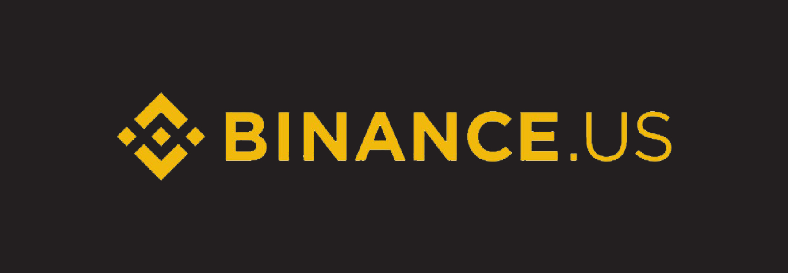                     | [Binance US](https://www.binance.com/)                                    |                                [spot](https://hummingbot.org/exchanges/binance-us/)                                |                                                                                                                                           |                                                                                                                                                    |
| 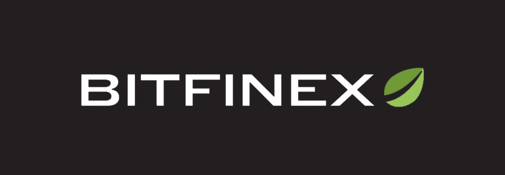                         | [Bitfinex](https://bitfinex.com/?refcode=dxCUrjvc)                        |                                 [spot](https://hummingbot.org/exchanges/bitfinex/)                                 |                                                                                                                                           | [dxCUrjvc](https://bitfinex.com/?refcode=dxCUrjvc)                                                                                                 |
|                              | [Bitget](https://www.bitget.com/)                                         |                              [perps](https://bitgetlimited.github.io/apidoc/en/mix/)                               |                                                                                                                                           |                                                                                                                                                    |
|                            | [BitMart](https://www.bitmart.com/en?r=UM6fQV)                            |                                 [spot](https://hummingbot.org/exchanges/bitmart/)                                  |                                                                                                                                           | [UM6fQV](https://www.bitmart.com/en?r=UM6fQV)                                                                                                      |
| 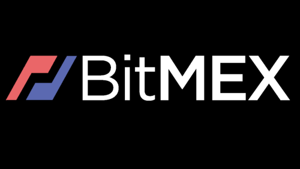                             | [Bitmex](https://www.bitmex.com/)                                         |   [spot](https://hummingbot.org/exchanges/bitmex/) / [perps](https://hummingbot.org/exchanges/bitmex-perpetual/)   |                                                                                                                                           |                                                                                                                                                    |
| 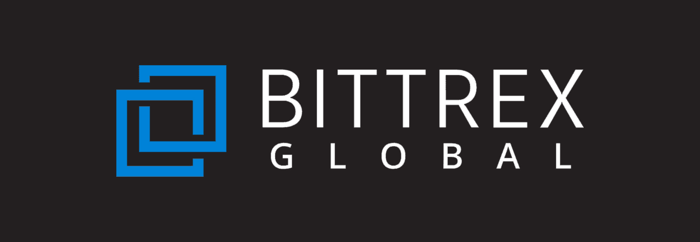 | [Bittrex Global](https://global.bittrex.com/)                             |                                 [spot](https://hummingbot.org/exchanges/bittrex/)                                  |                                                                                                                                           |                                                                                                                                                    |
| 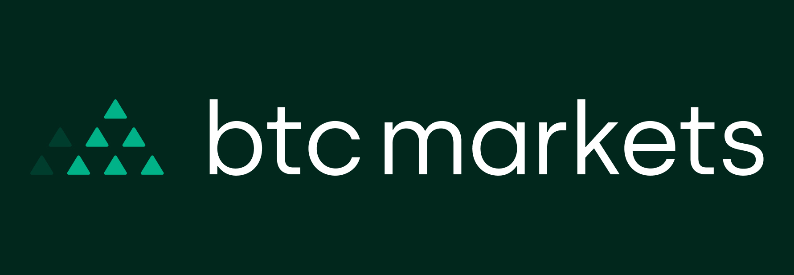                    | [BTC Markets](https://www.btcmarkets.net/)                                |                                      [spot](https://docs.btcmarkets.net/v3/)                                       |                                                                                                                                           |                                                                                                                                                    |
|                                | [Bybit](https://www.bybit.com/)                                           |    [spot](https://hummingbot.org/exchanges/bybit/) / [perps](https://hummingbot.org/exchanges/bybit-perpetual/)    |  |                                                                                                                                                    |
| 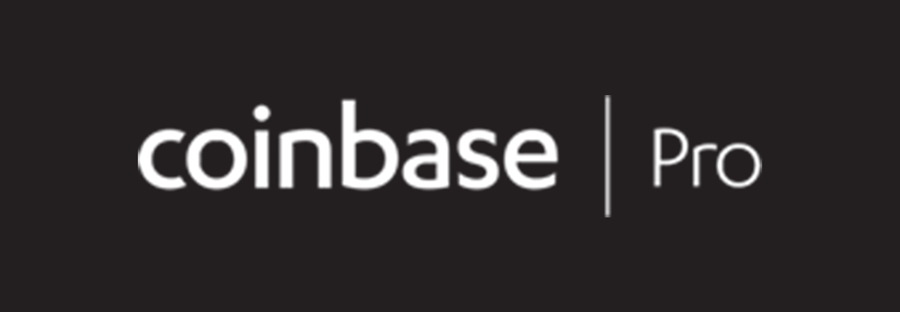                 | [Coinbase Pro](https://pro.coinbase.com/)                                 |                                 [spot](https://hummingbot.org/exchanges/coinbase/)                                 |                                                                                                                                           |                                                                                                                                                    |
|                          | [CoinZoom](https://trade.coinzoom.com)                                    |                                 [spot](https://hummingbot.org/exchanges/coinzoom/)                                 |                                                                                                                                           |                                                                                                                                                    |
|                       | [Crypto.com](https://crypto.com/exchange)                                 |                                [spot](https://hummingbot.org/exchanges/crypto-com/)                                |                                                                                                                                           |                                                                                                                                                    |
| 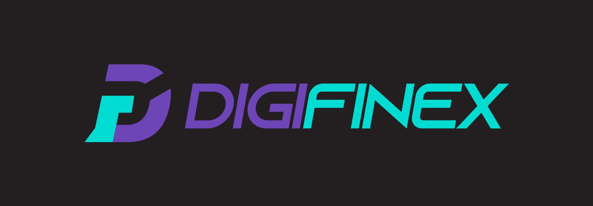                       | [Digifinex](https://www.digifinex.com/en-ww)                              |                                [spot](https://hummingbot.org/exchanges/digifinex/)                                 |                                                                                                                                           |                                                                                                                                                    |
|                            | [Gate.io](https://www.gate.io/signup/5868285)                             |                                 [spot](https://hummingbot.org/exchanges/gate-io/)                                  |  | [5868285](https://www.gate.io/signup/5868285)                         |
|                              | [HitBTC](https://hitbtc.com/)                                             |                                  [spot](https://hummingbot.org/exchanges/hitbtc/)                                  |  |                                                                                                                                                    |
|                  | [Huobi Global](https://www.huobi.com/register/?invite_code=en9k2223)      |                                  [spot](https://hummingbot.org/exchanges/huobi/)                                   |  | [en9k2223](https://www.huobi.com/register/?invite_code=en9k2223)                                                                                   |
| 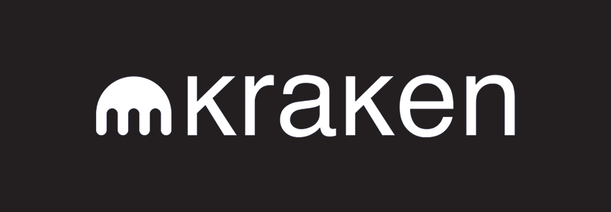                             | [Kraken](https://www.kraken.com/)                                         |                                  [spot](https://hummingbot.org/exchanges/kraken/)                                  |                                                                                                                                           |                                                                                                                                                    |
|                              | [KuCoin](https://www.kucoin.com/ucenter/signup?rcode=272KvRf)             |                                  [spot](https://hummingbot.org/exchanges/kucoin/)                                  |  | [272KvRf](https://www.kucoin.com/ucenter/signup?rcode=272KvRf)                                                                                     |
| 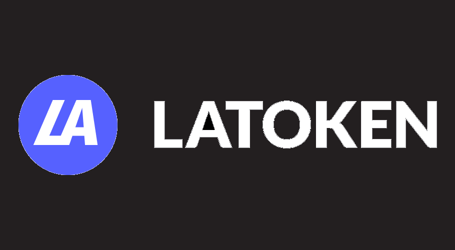                           | [Latoken](https://latoken.com/)                                           |                                 [spot](https://hummingbot.org/exchanges/latoken/)                                  |                                                                                                                                           |                                                                                                                                                    |
| 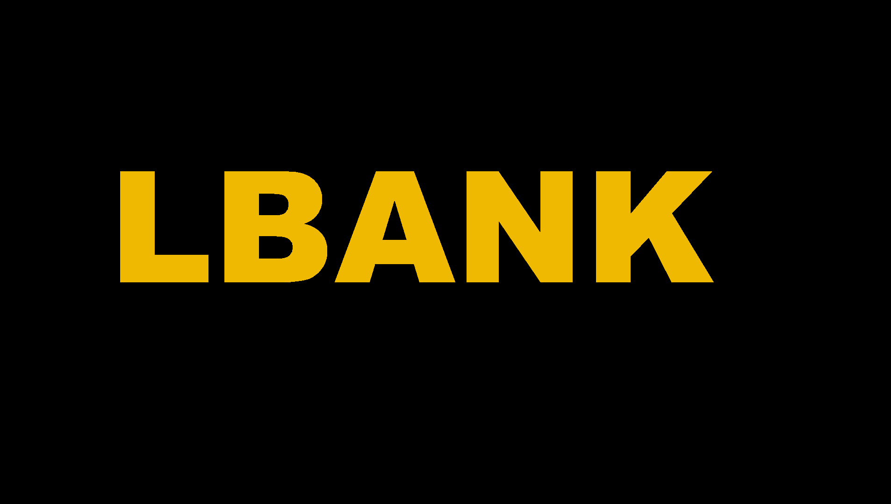                           | [LBank](https://www.lbank.info//)                                           |                                 [spot](https://hummingbot.org/exchanges/lbank/)                                  |                                                                                                                                           |                                                                                                                                                    |
| 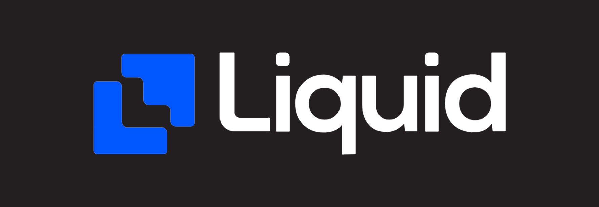                             | [Liquid](https://www.liquid.com/)                                         |                                  [spot](https://hummingbot.org/exchanges/liquid/)                                  |                                                                                                                                           |                                                                                                                                                    |
|                                       | [MEXC Global](https://www.mexc.com/)                                      |                                   [spot](https://hummingbot.org/exchanges/mexc/)                                   |                                                                                                                                           |                                                                                                                                                    |
| 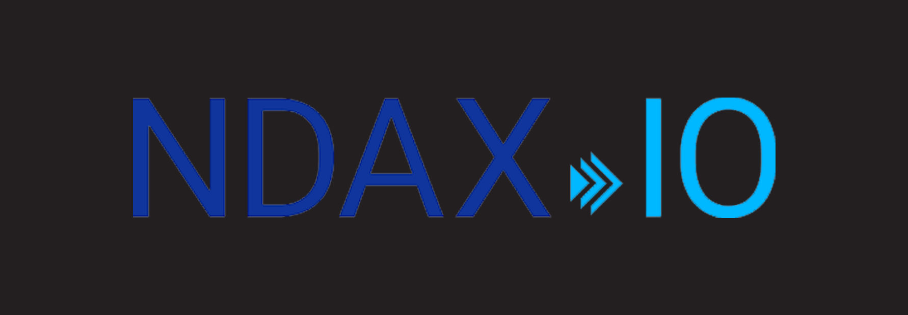                                 | [NDAX](https://ndax.io/)                                                  |                                   [spot](https://hummingbot.org/exchanges/ndax/)                                   |                                                                                                                                           |                                                                                                                                                    |
|                                  | [OKX](https://www.okx.com/join/1931920)                                   |                                   [spot](https://hummingbot.org/exchanges/okx/)                                    |  | [1931920](https://www.okx.com/join/1931920)                           |
| 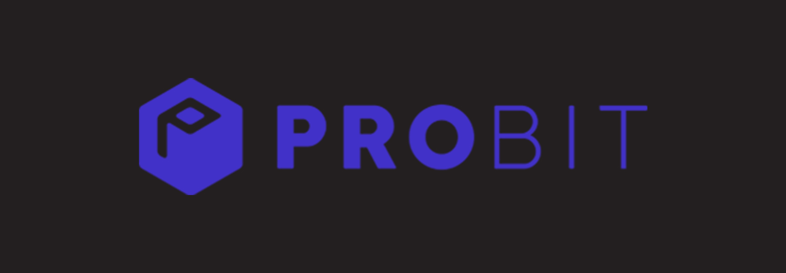                      | [Probit Global](https://www.probit.com/)                                  |                                  [spot](https://hummingbot.org/exchanges/probit/)                                  |                                                                                                                                           |                                                                                                                                                    |
| 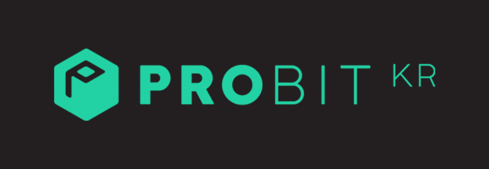                    | [Probit Korea](https://www.probit.kr/en-us/)                              |                               [spot](https://hummingbot.org/exchanges/probit-korea/)                               |                                                                                                                                           |                                                                                                                                                    |
| 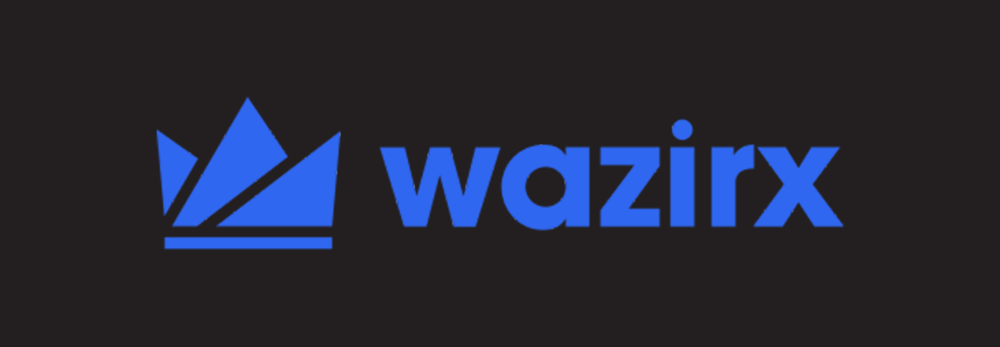                             | [WazirX](https://wazirx.com/)                                             |                                  [spot](https://hummingbot.org/exchanges/wazirx/)                                  |                                                                                                                                           |                                                                                                                                                    |
| 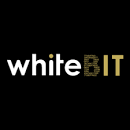                             | [Whitebit](https://whitebit.com//)                                             |                                  [spot](https://hummingbot.org/exchanges/whitebit/)                                  |                                                                                                                                           |                                                                                                                                                    |

## Decentralized Exchange Connectors

| logo                                                               | name                                     |                            docs (by connector type)                             | certified | signup code |
|--------------------------------------------------------------------|------------------------------------------|:-------------------------------------------------------------------------------:|:---------:|-------------|
|  | [dYdX Perpetual](https://dydx.exchange/) |          [perp clob](https://hummingbot.org/exchanges/dydx-perpetual/)          |           |             |
|    | [Loopring](https://loopring.io/)         |             [spot clob](https://hummingbot.org/exchanges/loopring/)             |           |             |
| 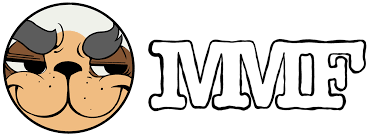 | [MM Finance](https://mm.finance/swap)          |           [amm](https://hummingbot.org/gateway/exchanges/mm-finance/)            |           |             |
| 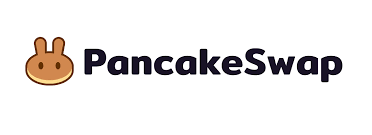 | [PancakeSwap](https://pancakeswap.finance/)        |           [amm](https://hummingbot.org/gateway/exchanges/pancakeswap/)            |           |             |
|    | [Pangolin](https://pangolin.exchange/)   |            [amm](https://hummingbot.org/gateway/exchanges/pangolin/)            |           |             |
|  | [Quickswap](https://quickswap.exchange)  |           [amm](https://hummingbot.org/gateway/exchanges/quickswap/)            |           |             |
| 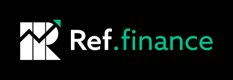 | [Ref.Finance](https://www.ref.finance/)          |           [amm](https://hummingbot.org/gateway/exchanges/ref-finance/)            |           |             |
| 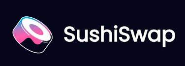 | [Sushiswap](https://sushi.com/)          |           [amm](https://hummingbot.org/gateway/exchanges/sushiswap/)            |           |             |
|  | [TraderJoe](https://traderjoexyz.com/)   |           [amm](https://hummingbot.org/gateway/exchanges/traderjoe/)            |           |             |
|      | [Uniswap](https://uniswap.org/)          | [concentrated liquidity amm](https://hummingbot.org/gateway/exchanges/uniswap/) |           |             |
| 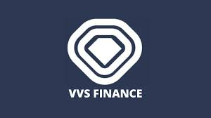 | [VVS Finance](https://vvs.finance/swap)         |           [amm](https://hummingbot.org/gateway/exchanges/vvs-finance/)            |           |             |

## Getting Started

* [Website](https://hummingbot.org)
* [Docs](https://hummingbot.org/docs)
* [FAQs](https://hummingbot.org/faq/)
* [Installation](https://hummingbot.org/installation/)
* [Developers](https://hummingbot.org/developers/)

### Community

* [Discord](https://discord.gg/hummingbot)
* [Youtube](https://www.youtube.com/c/hummingbot)
* [Twitter](https://twitter.com/hummingbot_io)
* [Reddit](https://www.reddit.com/r/Hummingbot/)
* [Forum](https://hummingbot.discourse.group/)

## Other Hummingbot Repos

* [Hummingbot Site](https://github.com/hummingbot/hummingbot-site): Official website and documentation for Hummingbot - we welcome contributions here too!
* [Hummingbot Project Management](https://github.com/hummingbot/pm): Agendas and recordings of regular Hummingbot developer and community calls
* [Awesome Hummingbot](https://github.com/hummingbot/awesome-hummingbot): All the Hummingbot links
* [Hummingbot StreamLit Apps](https://github.com/hummingbot/streamlit-apps): Hummingbot-related StreamLit data apps and dashboards

## Contributions

Hummingbot belongs to its community, so we welcome contributions! Please review these [guidelines](./CONTRIBUTING.md) first.

To have your pull request reviewed by the community, submit a [Pull Request Proposal](https://snapshot.org/#/hbot-prp.eth) on our Snapshot. Note that you will need 1 HBOT in your Ethereum wallet to submit a Pull Request Proposal. See <https://www.coingecko.com/coins/hummingbot> for markets where HBOT trades.

## Legal

* **License**: Hummingbot is licensed under [Apache 2.0](./LICENSE).
* **Data collection**: read important information regarding [Hummingbot Data Collection](./DATA_COLLECTION.md).
