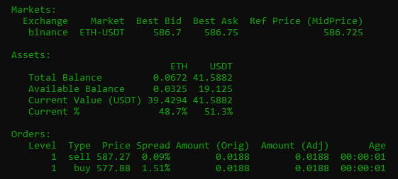
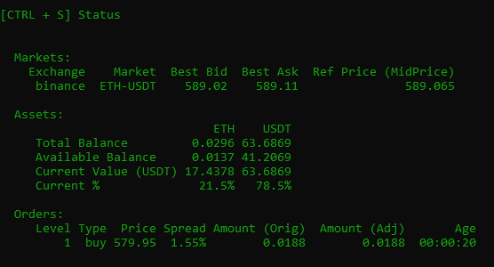

**Updated on version [0.35.0](/release-notes/0.35.0)**

Sets the amount limit on how much assets Hummingbot can use in an exchange or wallet. This can be useful when running multiple bots on different trading pairs with the same tokens, e.g., running a BTC-USDT pair and another bot on ETH-USDT using the same account.

## How It Works

You can set how much of a particular token the bot can use by running the command `balance limit [exchange] [asset] [amount]`. You can disable this feature by editing it in the global config file and set it to -1. While setting it to 0 will initially not place any order for a specific asset until a trade is executed to accumulate the said asset.

For example:

```
>>>  balance limit binance USDT 100
Limit for USDT on binance exchange set to 100.0
```

Run the `balance limit` to confirm the limit has been applied.

```
>>>  balance limit
Balance Limits per exchange...

binance
    Asset     Limit
     USDT  100.0000
```

## Example Scenario

Create pure market making strategy, run `config` to view the whole configuration.


Run `balance limit binance ETH 0.0513` to set the balance limit to 0.0513 ETH. Run `balance limit binance USDT 30` to set the balance limit to 30 USDT. Both ETH and USDT value is equivalent to \$30.


Each order is 0.0188 equivalent to \$11.20



Sell order gets filled. USDT available balance is now 30.1657


Another sell order gets filled, the available balance now shows 41.2069. Plus the open buy order, the "usable" balance on USDT is now at around \$52.



After the two sell orders are filled, the remaining balance in ETH is 0.0137 equivalent to $8.17. It means that after the next `order_refresh_time` it won't create sell order because the minimum order amount is $11.


Same process as the scenario above. After the two buy orders gets filled the remaining available balance in USDT is 7.5317 equivalent to $7.53. It means that after the next `order_refresh_time` it won't create buy order because the minimum order amount is $11.


