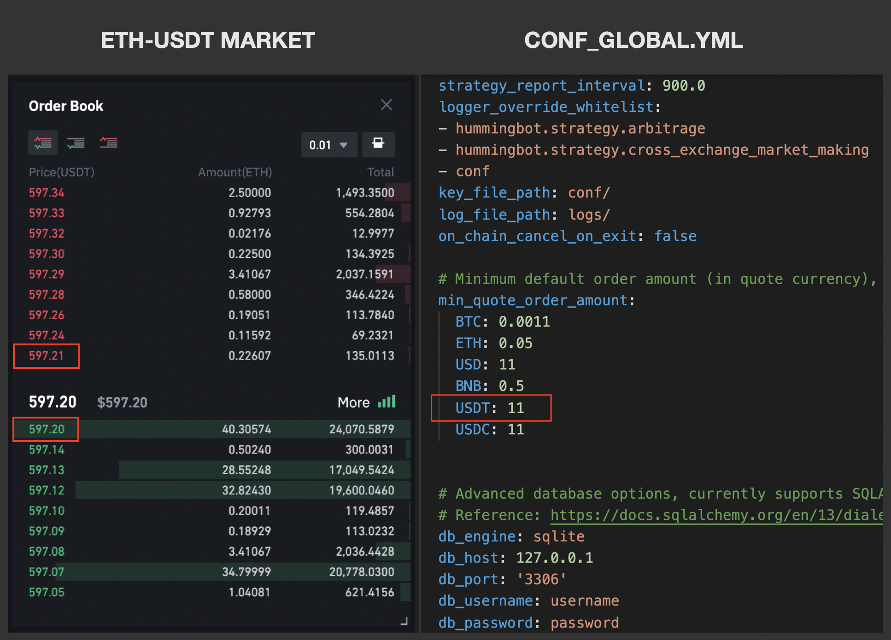

## How It Works

When setting the `order_amount` for pure market making or cross-exchange market-making, Hummingbot has set its own minimum order size to help ensure orders are created when running the strategy.

It is important to note that this will not always be exactly the same as the exchange's trading rules. In Hummingbot, the minimum order size is calculated as:

By default, we set the minimum to an equivalent of \$11, which is defined under `min_quote_order_amount` in the global config file. The `market_mid_price` is the average of the order book's best bid and best ask.

Based on the calculation and the example above, the `min_order_size` is 0.0184 ETH.

## How To Override

If you wish to set the bot to trade at your desired quote value for better risk management, the `min_quote_order_amount` section in the **conf_global.yml** needs to be edited.

1. Download and open the **conf_global.yml** file
2. Scroll down to the `min_quote_order_amount` section
3. Enter or edit the values accordingly
4. Restart if Hummingbot is running

## Important Notes

The minimum order size changes from time to time when the market price fluctuates due to market volatility (determined by the order price and volume). If the `order_amount` falls below the exchange's minimum order size, the orders will not be created.

Using a value near to the exchange's minimum order size (not Hummingbot's) may cause orders not created due to volatility.
