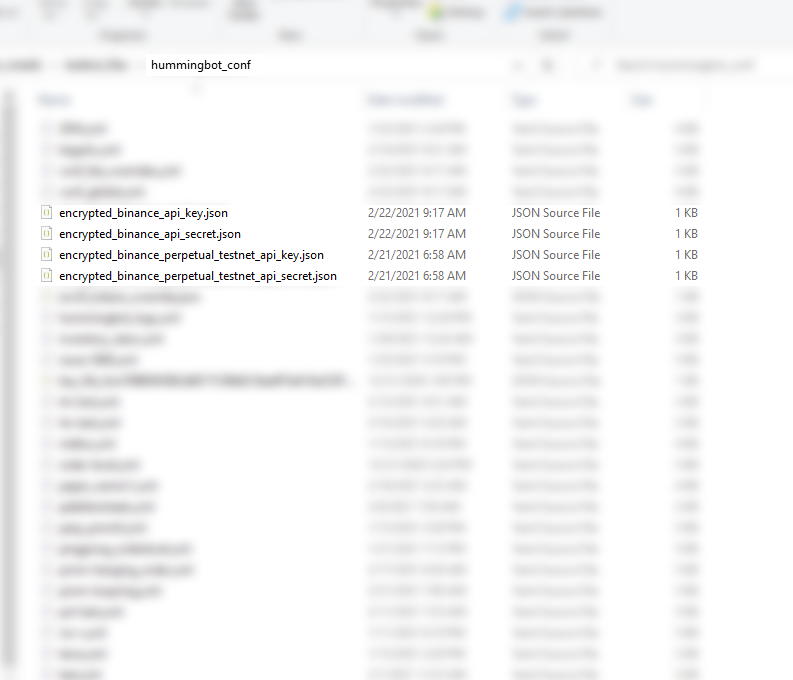
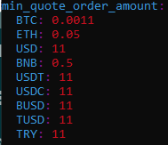
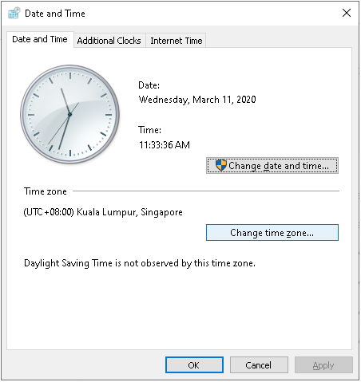
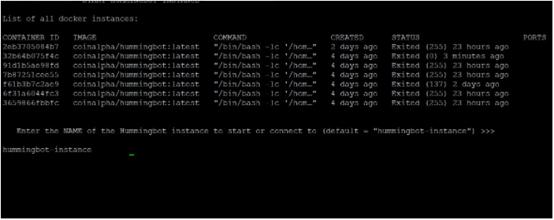
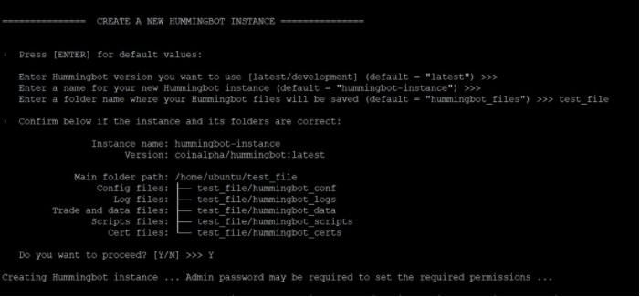

import Callout from "../../src/components/Callout";

### Locate config and log files

Hummingbot saves user data in the following directories:

- `conf`: strategy configuration files
- `log`: log files
- `data`: executed trades, saved in a sqlite database

Below are instructions on how to access these files in various environments.

**Windows**

1. Open File Explorer, select This PC and open local disc (C:)
2. Browse to the Users folder, and open your profile folder.
3. Locate and open AppData folder
4. Open Local folder then Hummingbot.io folder. You may see another folder named Hummingbot, open it and you will see the data files folder.

<Callout
  type="tip"
  body="In case the AppData folder is not visible, on the menu bar found above your folder, go to View and tick the checkbox for Hidden items."
  link={[""]}
/>

**MacOS**

1. Open Finder
2. On the top menu bar, click Go
3. After clicking the Go menu, press the Option button on your keyboard.
4. Additional Library option should appear after that.
5. Click Library
6. Find and open Application Support folder and you will see Hummingbot folder.

<Callout
  type="note"
  body="Mac has multiple library folders, make sure that the library folder you're trying to open is the Library folder under your user profile."
  link={[""]}
/>

Docker

1. Run the following command to view the details of your instance:
   `docker inspect $instance_name`
2. Look for a field Mounts, which will describe where the folders are on your local machine:

```
"Mounts": [
    {
        "Type": "bind",
        "Source": "/home/ubuntu/hummingbot_files/hummingbot_data",
        "Destination": "/data",
        "Mode": "",
        "RW": true,
        "Propagation": "rprivate"
    },
    {
        "Type": "bind",
        "Source": "/home/ubuntu/hummingbot_files/hummingbot_conf",
        "Destination": "/conf",
        "Mode": "",
        "RW": true,
        "Propagation": "rprivate"
    },
    {
        "Type": "bind",
        "Source": "/home/ubuntu/hummingbot_files/hummingbot_logs",
        "Destination": "/logs",
        "Mode": "",
        "RW": true,
        "Propagation": "rprivate"
    }
],
```

3. Go to the folder locations listed under Source.

---

### MAC Mismatch error

```
Hummingbot.core.utils.async_utils - ERROR - Unhandled error in background task: MAC mismatch Traceback (most recent call last):
File "/home/ubuntu/hummingbot/hummingbot/core/utils/async_utils.py", line 9, in safe_wrapper return await c
File "/home/ubuntu/hummingbot/hummingbot/core/utils/async_call_scheduler.py", line 128, in call_async return await self.schedule_async_call coro, timeout_seconds, app_warning_msg=app_warning_msg)
File "/home/ubuntu/hummingbot/hummingbot/core/utils/async_call_scheduler.py", line 117, in schedule_async_call return await fut
File "/home/ubuntu/hummingbot/hummingbot/core/utils/async_call_scheduler.py", line 80, in _coro_scheduler fut.set_result(await coro)
File "/home/ubuntu/miniconda3/envs/hummingbot/lib/python3.8/concurrent/futures/thread.py", line 57, in run result = self.fn(*self.args, **self.kwargs)
File "/home/ubuntu/hummingbot/hummingbot/client/config/security.py", line 88, in decrypt_all cls.decrypt_file(file)
File "/home/ubuntu/hummingbot/hummingbot/client/config/security.py", line 73, in decrypt_file cls._secure_configs[key_name] = decrypt_file(file_path, Security.password)
File "/home/ubuntu/hummingbot/hummingbot/client/config/config_crypt.py", line 67, in decrypt_file secured_value = Account.decrypt(encrypted, password)
File "/home/ubuntu/miniconda3/envs/hummingbot/lib/python3.8/site-packages/eth_account/account.py", line 134, in decrypt return HexBytes(decode_keyfile_json(keyfile, password_bytes))
File "/home/ubuntu/miniconda3/envs/hummingbot/lib/python3.8/site-packages/eth_keyfile/keyfile.py", line 49, in decode_keyfile_json return _decode_keyfile_json_v3(keyfile_json, password)
File "/home/ubuntu/miniconda3/envs/hummingbot/lib/python3.8/site-packages/eth_keyfile/keyfile.py", line 170, in _decode_keyfile_json_v3 raise ValueError("MAC mismatch")
ValueError: MAC mismatch
```

This error is usually caused by having multiple encrypted keys with different passwords in the same config folder. For example:

```
Instance1                       Instance2
Password  : 1234                Password  : 5678
API key/s : Binance             API key/s : Bittrex, Coinbase Pro,
                                            Eterbase, Kraken, Huobi
```

Copying the encrypted Binance key file from Instance1 to Instance2 will result in this error. To fix this:

1. Delete just the `encrypted_binance_api/secret_key.json` from Instance2's conf folder
2. Restart Hummingbot and password 5678 remains unchanged
3. Run `connect binance` and add the API keys - this will encrypt it with 5678 password and sync it with the rest of the API keys

---

### Copy and paste your API keys

Copying and pasting your API keys into Hummingbot may be problematic, especially in Docker installations or for PuTTY users. See below for how to copy/paste in different environments.

Ways to copy and paste on different operating systems

Copy on Windows or Linux

```
Ctrl + c
Ctrl + Insert
Ctrl + Shift + c
Shift + Select text to copy then Enter
```

Paste on Windows or Linux

```
Ctrl + v
Ctrl + Insert
Ctrl + Shift + v
Shift + Right mouse click
```

---

### Reset your global configuration to default settings

Editing `conf_global.yml` from text editor sometimes can cause an error or corrupted configuration when running Hummingbot, it's because of incorrect format, incorrect parameters, wrong spelling, and unintentionally added characters to the global config.

Run `exit` command to exit from the Hummingbot client.
Delete `conf_global.yml` from the hummingbot_conf folder.
Restart Hummingbot and a new generated conf_global.yml will be created, type config command to see the global configuration.

If using Linux, copy the commands below and run in your terminal to delete the file. You will be prompted to confirm before proceeding.

```
rm hummingbot_files/hummingbot_conf/conf_global.yml
rm hummingbot/conf/conf_global.yml
```

If Hummingbot is installed on Windows, simply delete the `conf_global.yml` found in `%localappdata%\hummingbot.io\Hummingbot\conf`.

If Hummingbot is installed on macOS, simply delete the `conf_global.yml` found in `~/Library/Application\ Support/Hummingbot/Conf`.

<Callout
  type="note"
  body="If telegram is enabled make sure to backup your telegram token and chat id when deleting `conf_global.yml`"
  link={[""]}
/>

---

### Edit your config files from the command line

If Hummingbot is installed on a virtual machine or a Linux cloud server, you can use the vi text editor (or any text editor of your choice). Run command vi `$filename`. Visit this [link](https://www.tipsandtricks-hq.com/unix-vi-commands-take-advantage-of-the-unix-vi-editor-374) for more information on how to use this text editor.

You can also use an FTP client software (e.g. WinSCP, FileZilla) to copy, move, files and folders from your virtual machine to your local machine and vice versa.

### How to delete or remove exchange API keys?

The encrypted API key files can be seen inside your Hummingbot folder. To delete, you would need to make sure your bot has stopped or exit correctly.

**Docker**

Your API keys are under the hummingbot_conf folder. For example `encrpyted_binance_api_key.json` or `encrypted_binance_api_secret.json`.



**Source**

Go to the conf folder and delete the encrypted file. For example encrpyted_binance_api_key.json or encrypted_binance_api_secret.json.


Open your Hummingbot again and run connect command to see the list of exchange connectors.

### Resize your Hummingbot window without jumbling the text

When resizing the window of your Hummingbot, the text becomes unclear or at the same location as the previous size of the window. To do a refresh to the new window size, while inside Hummingbot press `CTRL + L` and it will refresh Hummingbot window panes. This command applies to all Hummingbot builds.

### How to remove minimum order size by editing `min_quote_order_amount`

For some users wishing to change their minimum order size, we have a way to do that.

First, you have to locate your conf_global.yml and download it. You can locate it under `[hummingbot_folder_name]/hummingbot_conf`.

Once you have downloaded it edit the file and scroll down to min_quote_order_amount and change the value of your specified token.



Then save and restart the hummingbot if it is running

<Callout
  type="note"
  body="Keep in mind that using a value near to the exchange's minimum order size (not Hummingbot's) may cause orders not created due to volatility"
  link={[""]}
/>

---

### How to move Hummingbot configuration to new Hummingbot instance?

Here are steps you can follow:

1. Copy `hummingbot_conf` folder from the source bot files to the target bot files.

2. You can also run this command on your terminal `cp -a [source_bot]_files/hummingbot_conf/* [target_bot]_files/hummingbot_conf/`

---

### Change the time or timezone of Hummingbot

Hummingbot follows the same date/time and timezone on the machine where it is intalled. Below are some steps you can follow to change the timezone depending on the operating system and installation type.

**Docker**

While docker `$instance_name` is running in the background, type in the command line.

```
#Run this command
docker exec -u 0 -it instance_name bash

#Install tzdata for the instance/container
apt-get update && apt-get install -y tzdata

#Run this command to change the docker timezone
dpkg-reconfigure tzdata
```

Configure geographic location and timezone by inputting the corresponding number, see example below:


Restart your docker and start your Hummingbot again to apply changes.

**Windows**

You can change the timezone on a Windows computer by doing the following:

1. Press **Win + R** shortcut to open the Run dialog box

2. Enter **timedate.cpl** to open Date and Time settings

3. Click **Change time zone**



You can also follow these steps in the Windows Support article: [How to set your time and timezone](https://support.microsoft.com/en-us/windows/how-to-set-your-time-and-time-zone-dfaa7122-479f-5b98-2a7b-fa0b6e01b261)

---

### Hummingbot via Cloud Server Freezes/Crashes - Troubleshoot Steps

If you're stuck in the terminal window where you attempt to open or create a new instance for Hummingbot, there might already be a malfunction that causes the software/application to freeze or crash.





Whenever this happens, you will need to exit and restart the application to make it working again. Here are some troubleshooting steps that you can try to fix the issue.

**Check your Cloud Hosting specifications**

Every instance of Hummingbot consumes storage space, make sure that your Cloud Hosting service plan can accomodate the number of Hummingbot instances you're creating. Reaching the Memory Storage limit will cause the application or terminal to crash.

**Restart the Cloud Server**

Steps to restart your Cloud Server depend on which platform you're using. You may check the steps on how to restart your Cloud Server from your platform's website.

---
