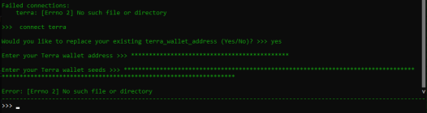

## Timestamp for this request is outside of the recvWindow

```
binance.exceptions.BinanceAPIException: APIError(code=-1021): Timestamp for this request is outside of the recvWindow.
```

Timestamp errors in logs happen when the Binance clock gets de-synced from time to time as they can drift apart for several reasons. Hummingbot should safely recover from this and continue running normally.

---

## Too much request weight used; IP banned

### Sample log error message

```
binance.exceptions.BinanceAPIException: APIError(code=-1003): Way too much request weight used; IP banned until 1573987680818. Please use the WebSocket for live updates to avoid bans
```

This error occurs when the Binance API rate limit is reached. Causes include:

- Using multiple order mode with 3+ orders per side
- High order refresh rate
- Running multiple instances of Hummingbot
- Weight/Request error in logs happens when it encounters a warning or error and Hummingbot repeatedly sends the request (fetching status updates, placing/canceling orders, etc.) which resulted in getting banned. This should be lifted after a couple of hours or up to a maximum of 24 hours.

---

## Kraken

### 0 Balance error

```
Failed connections:                                                                                      |
    kraken: {'error': {'error': []}}

10:12:24 - kraken_market - Error received from https://api.kraken.com/0/private/Balance. Response is {'error': []}.
```

This error occurs when Kraken account currently has no funds on the exchange. Fund your account to fix the error. For more info, visit this [here](https://support.kraken.com/hc/en-us/articles/360001491786-API-Error-Codes).

---

## Kucoin

### Failed to submit buy order to Kucoin. Check API key and network connection

```
kucoin_exchange - Failed to submit buy order to Kucoin. Check API key and network connection.
```

This error occurs when the exchange has an insufficient balance to create an order. Possible causes:

- `order_amount` was set to a higher value compared to your token balance
- When using a `liquidity_mining` strategy, check if you have the proper `token` set to provide liquidity

---

## Terra

### Failed to connect wallet address and wallet seeds

```
Error: [Errno 2] No such file or directory
```



- Make sure to have Terra set up when you create your [gateway](/protocol-connectors/terra/) instance
- Make sure that the address that your trying to `connect` is from the right network, either mainnet or testnet
