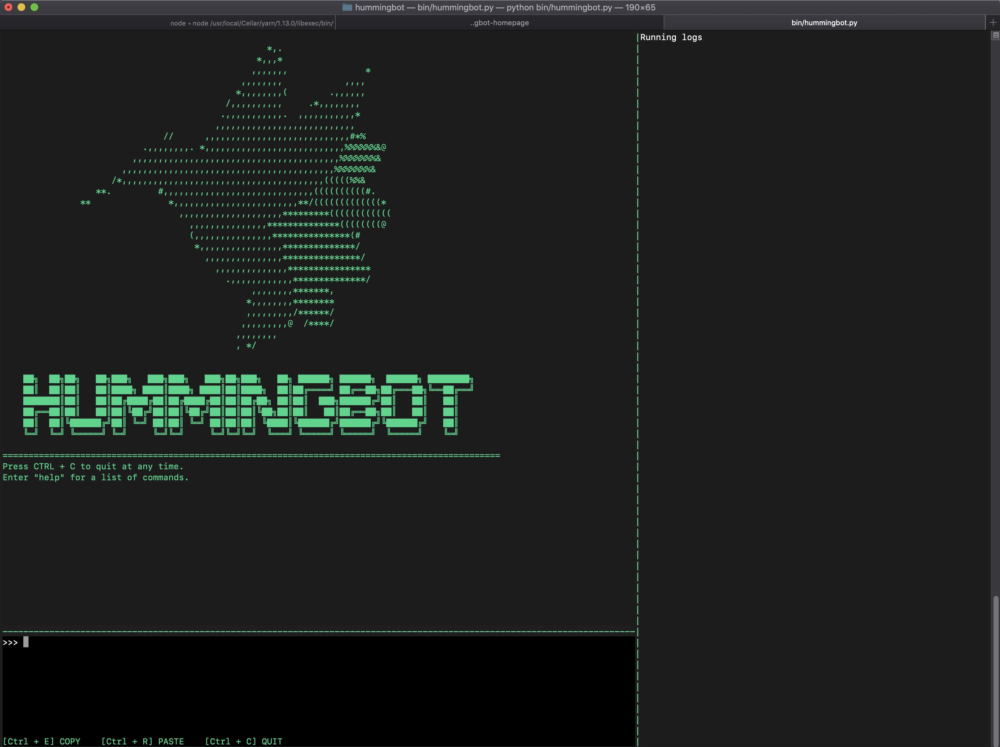

# The Hummingbot Client

Hummingbot uses a command-line interface (CLI) that helps users configure and run the bot, as well as generate logs of the trades performed.

## Starting `hummingbot` using Docker

Creating a new instance of `hummingbot` with `docker run` will automatically start the `hummingbot` client (see [Installation](/installation#create-new-instance-of-hummingbot)).

To run a previously created, stopped container:

```sh
docker start $NAME && docker attach $NAME
```

---

## Starting `hummingbot` from local installation

!!! note
    Make sure that you activate the Anaconda environment with `conda activate hummingbot-dist` prior to running Hummingbot.

Open a Terminal window and go to the root of the directory that contains Hummingbot. From there, run:
```
hummingbot.py
```

---

## User interface

### Layout


The CLI is divided into three panes:
* **Input pane (lower left)**: where users enter commands
* **Output pane (upper left)**: prints the output of the user's commands
* **Log pane (right)**: log messages

### Commands

| Command | Function |
|---------|----------|
| `help` | Prints a list of available commands.
| `config` | Configure the bot.  When running for the first time, initializes the bot.  If the bot has already been initialized, unlocks the Ethereum wallet.
| `start` | Starts the bot. If any configuration settings are missing, it will automatically prompt you for them.
| `stop` | Cancels all outstanding orders and stops the bot.
| `status` | Get a status report about price differential between the two exchanges, as well as current orders.
| `list` | List wallets, exchanges, orders, and configs.<br/><br/>*Example usage: `list [wallets|exchanges|orders]`*
| `describe` | Get detailed information about wallets, exchanges, and orders.<br/><br/>*Example usage: `describe [-w|-e binance|-e ddex]` to show details of wallets, binance positions, wallet balances (available for DDEX), respectively*.
| `get_balance` | Gets the balance of an exchange or wallet.<br/><br/>*Example usage: `get_balance [-c WETH -w|-c ETH -e binance]` to show available WETH balance in the Ethereum wallet and ETH balance in Binance, respectively*.
| `exit` \| `CTRL + C` | Cancels all orders, saves the log, and exits Hummingbot.
|`exit -f`| Force quit without cancelling orders.

<hr />

# Next: [Configure the bot](/configuration)