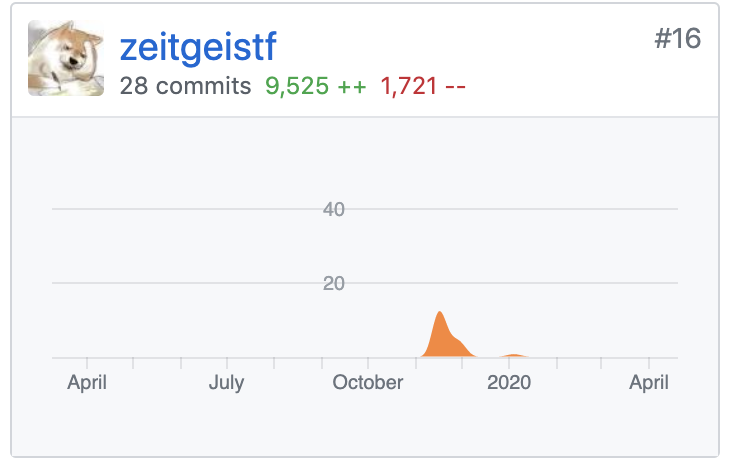
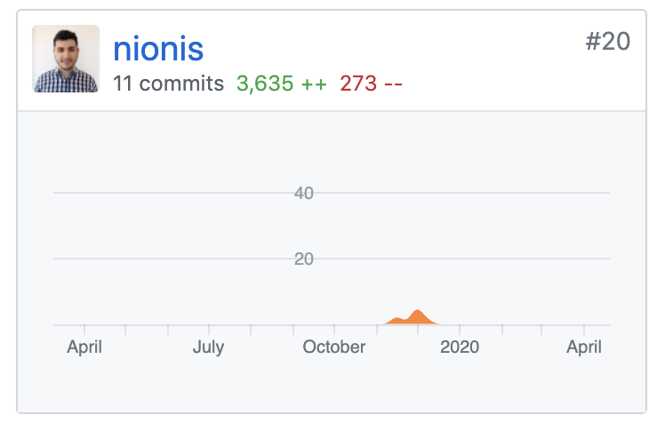
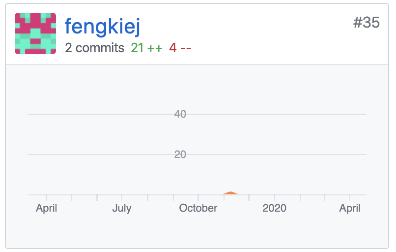
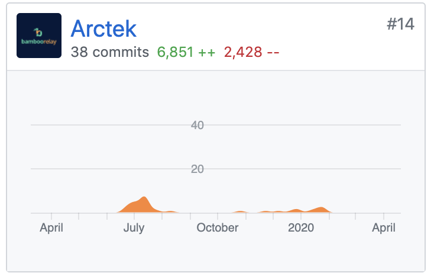
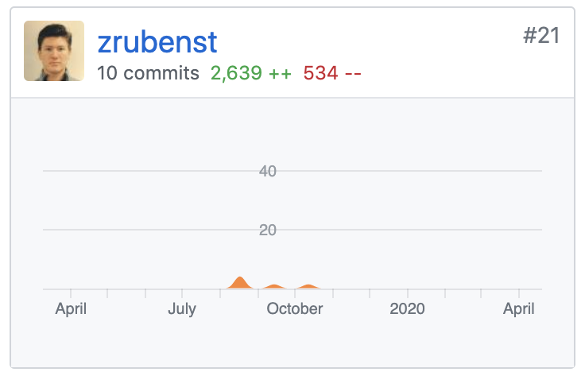

## Overview

Welcome to the community contributions page, where we’ll list out all the community contributed projects of Hummingbot, show our recognition and appreciation to these community members who made the contributions and provide necessary resources for users who plan to make any kind of contributions. 

Hummingbot is an open source community of developers who seek to democratize algo trading. We welcome contributions from anyone in various areas below.
 
## List of community contributions

### Core Hummingbot connectors

A bunch of community members have also worked on creating our core connectors such as Liquid and Kucoin. We would love to express our gratitude to below developers who have spent time and efforts to expand Hummingbot core team’s bandwidth and make Hummingbot better!

| Contributor's Github contact | Commits | Exchange | Status | 
| --- |:---:|:---:|:---:|
| [vic-en](https://github.com/vic-en) |  | KuCoin | Active | 
| [zeitgeistf](https://github.com/zeitgeistf) |  | Liquid | Active |
| [nionis](https://github.com/nionis) |  | Bitfinex | In progress |  
| [fengkie](https://github.com/fengkiej) |  | HitBTC | In progress |  

### Community-contributed connectors

Currently, Hummingbot has two community-contributed connectors that are created and maintained by their developers. We would love to see more exchange developers join this game and connect their exchanges to Hummingbot in the future.   

| Contributor's Github contact | Commits | Exchange | Status | 
| --- |:---:|:---:|:---:|
| [Arctek](https://github.com/Arctek) |  | Bamboo Relay | Active | 
| [zrubenst](https://github.com/zrubenst) |  | Dolomite | Active | 

- Both connectors were last updated in Hummingbot v.0.21.0.
- For more information, please refer to [this page](https://docs.hummingbot.io/connectors/#community-contributed-exchange-connectors). 

### Bug fixes or feature creation

Some community members work on fixing bugs or creating new features. These efforts significantly improve our user experience and help the Hummingbot core team move faster. 

| Contributor's Github contact | Category | Issue title | Pull request | 
| --- |:---:|:---:|:---:|
| [fengkie](https://github.com/fengkiej) | Feature | [Pure-MM Strategy: Allow for Fewer than Total Quantity of Multiple Orders per Side](https://github.com/CoinAlpha/hummingbot/issues/517) | [PR #1613](https://github.com/CoinAlpha/hummingbot/pull/1613) | 

### Other contributions

#### Performance calculator

Our long-time user and the Eagle Club member, [Dominator008](https://github.com/Dominator008) has created a simple [Hummingbot performance calculator](https://github.com/Dominator008/hummingbot-trades-calculator), which prints differences in the base and quote currencies, and calculates profitability in terms of the quote currency based on the final price of the base currency. 

#### Chinese Wiki and Chinese website

One of our very first projects that derived from the community is our Chinese Wiki and Chinese website - hummingbot.cn. The contributor is [syuukawa](https://github.com/syuukawa). You can check out these resources through below links:

- [Chinese wiki on github](https://github.com//CoinAlpha/hummingbot_chinese) : Created by Syuukawa, and now also maintained by Hummingbot core team. 
- [Chinese website](http://hummingbot.cn/): Independently and solely maintained by the contributor.

#### Event organization

Our Singapore-based community member, [Frederick Fung](https://twitter.com/tokenomist_sg) helped us organize a very well-attended meetup in Singapore in November 2019. 

## How can I contribute to Hummingbot?

The scope of contributions is boundaryless. However, the goal is the same, that is to let more users access and use Hummingbot more easily, so the project needs to be public. Below, we share a list of contributions users can make according to your technical expertise. 

### Technical contributions

- Create and maintain new community-contributed connectors that link to new exchanges
- Create new core connectors based on the core team’s need
- Create third-party tools that supplement or expand Hummingbot’s functionality
- Help fix bugs 
- Create new useful Hummingbot features

### Non-technical contributions

- Translate Hummingbot docs into different languages, and make pull requests to an individual github repo (contact us to get the repo link for your specific language)
- Design a cute Hummingbot mascot 
- Help organize virtual or local meetups 
- Talk about Hummingbot in blogs or vlogs
- Contribute useful content to [the Hummingbot blog](https://hummingbot.io/blog/)
- Help maintain official Hummingbot Discord channel, or moderate official Hummingbot subreddit
- Create and maintain an unofficial chat group or forum

### Useful resources
- [Developer manual](https://docs.hummingbot.io/developers/)
- [Guideline for community developers](https://docs.hummingbot.io/developers/connectors/#guidelines-for-community-developers)
- Get support from peers and the core team, join the #community-connectors channel on our [Discord](https://discord.hummingbot.io) 

## How to list my contribution to this page?

We would love to recognize and show our appreciation to every community contribution, so don’t hesitate to contact us if you have made any. 

- Send your email to: yingdan@hummingbot.io
- Briefly describe your contribution
- Attach relevant information and links

Once we update the docs, we’ll notify you via email. 

