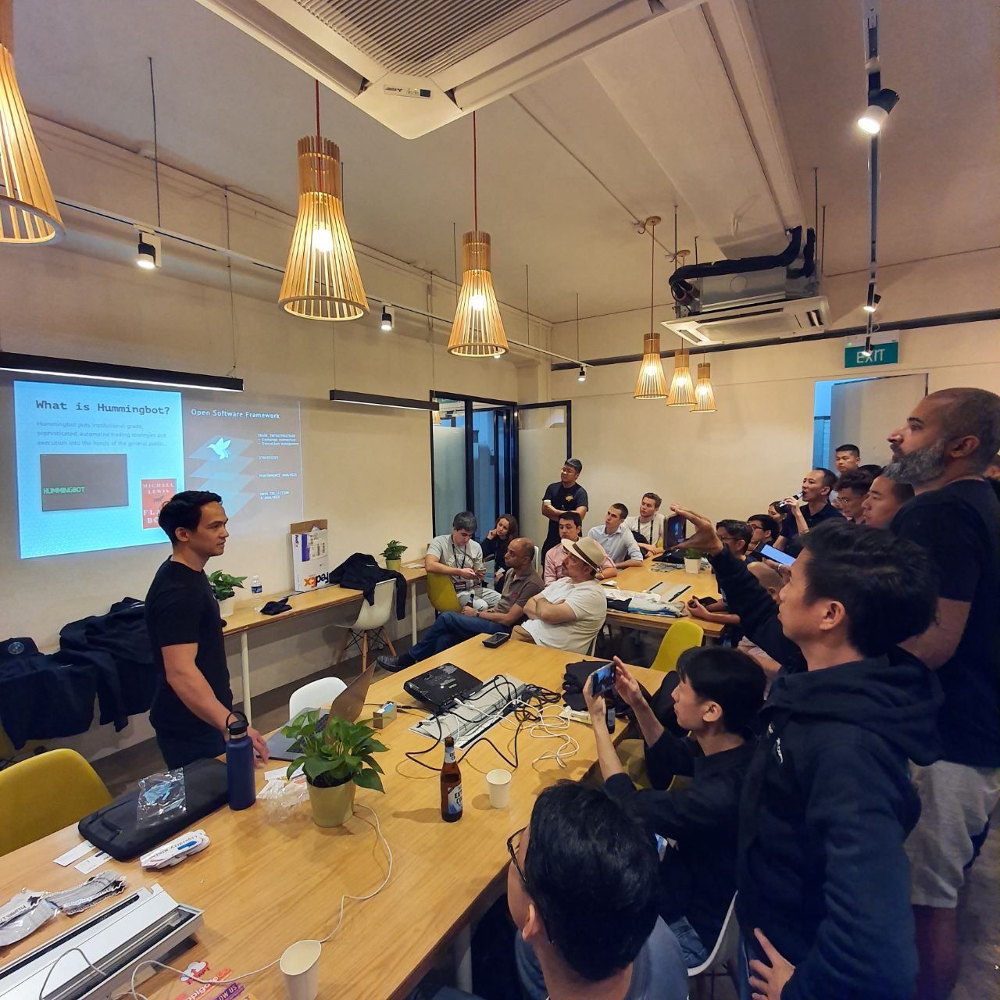

# Events

Hummingbot co-founder & COO Carlo Last Marias speaks at our Singapore meetup in November 2019

## Past events

| Event | City | Date | Organizer | 
| --- |:---:|:---:|:---:|
| Singapore market making meetup | Singapore | November 2019 | [Frederick Fung](https://twitter.com/tokenomist_sg) & Hummingbot | 
| DeFi SFBW closing event | San Francisco | November 2019 | Solana |
| #DeFi Assemble Osaka | Osaka | September 2019 | Hummingbot, imToken & 0x | 
| [Market making with 0x](https://www.youtube.com/watch?v=kjM7bY1Ci80&list=PLDwlNkL_4MMcVIeTejMYIuuCUPrPLEAmF&index=7) | San Francisco | August 2019 | Hummingbot & 0x | 
|  #DeFi & Emerging Economies panel | Berlin | August 2019 | Techstars | 
| [Fireside chat with Kevin Zhou of Galois Capital](https://www.youtube.com/watch?v=Xg4PcrXU_fM&list=PLDwlNkL_4MMcVIeTejMYIuuCUPrPLEAmF&index=4) | San Francisco | June 2019 | Hummingbot |
| [#DeFi for crypto traders NYC meetup](https://www.youtube.com/watch?v=F0TD08Gw6lY&list=PLDwlNkL_4MMcVIeTejMYIuuCUPrPLEAmF&index=3) | New York City | May 2019 | DeFi NYC, Hummingbot & other teams | 
| [Hummingbot launch party](https://www.youtube.com/watch?v=JkDR3J85QsY&list=PLDwlNkL_4MMcVIeTejMYIuuCUPrPLEAmF) | San Francisco | April 2019 | Hummingbot |
| [Big data and cryptocurrency meetup](https://www.youtube.com/watch?v=m-936JkIBug&list=PLDwlNkL_4MMcVIeTejMYIuuCUPrPLEAmF&index=2) | Palo Alto | February 2019 | Hummingbot |
| [What we learned from running a quant crypto hedge fund](https://www.slideshare.net/YingdanMoraLiang/what-we-learned-from-running-a-quant-crypto-hedge-fund) | San Francisco | January 2019 | Hummingbot |
