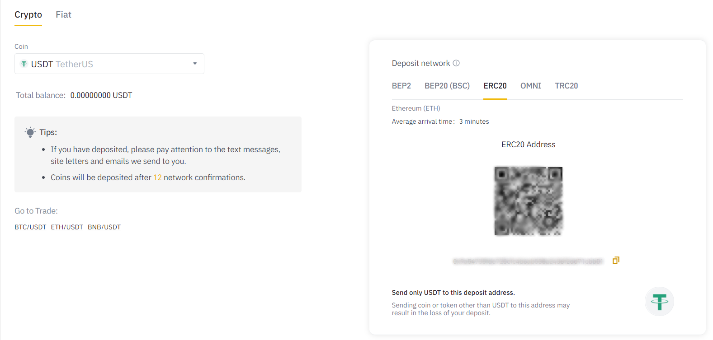
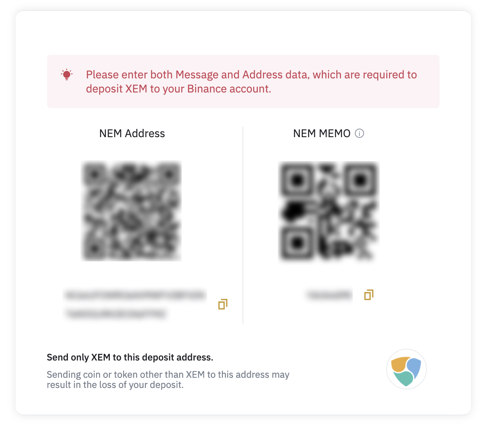

# Liquidity Mining FAQs

!!! info "Important Disclaimer"
    <small><ul><li>The content of this Site does not constitute investment, financial, legal, or tax advice, nor does any of the information contained on this Site constitute a recommendation, solicitation, or offer to buy or sell any digital assets, securities, options, or other financial instruments or other assets, or to provide any investment advice or service.<li>There is no guarantee of profit for participating in liquidity mining.<li>Participation is subject to eligibility requirements.</ul></small>
    **Please review the [Liquidity Mining Policy](https://hummingbot.io/liquidity-mining-policy/) for the full disclaimer.**

### What is liquidity mining?
Liquidity mining is a community-based, data-driven approach to market making, in which a token issuer or exchange can reward a pool of miners to provide liquidity for a specified token.

You earn rewards by running a market making bot that maintains orders on exchange order books. How much reward you earn depends on:

* The amount of your orders
* The spread (distance to the mid price) of your orders
* How long you maintain your orders on the order book

For more information, please read [the whitepaper](https://hummingbot.io/liquidity-mining.pdf).

### Why is it called "liquidity mining"?
Liquidity mining is similar to Bitcoin mining in that miners run open source software on their own computers and use their own scarce resources (inventory of crypto assets).

In addition, a collective pool of participants are working together for a common goal, providing liquidity for a specific token and exchange.  In return, miners are paid out rewards according to transparent, algorithmically defined rules.

### How do I interpret the numbers in Hummingbot Miners?

**Active Bots** is the total number of market making bots currently running/

**Liquidity** is the total eligible open order volume across all Active Bots currently. 

**Yield/Day** shows you how much you can earn per day currently. To calculate Yield/Day, divide the daily reward (**Reward/Day**) by Liquidity. 

!!! note
    The Yield/Day is solely based on liquidity rewards and does not take into account trades executed.

!!! warning "Liquidity mining yields do not include profits or losses from trading"
    The published Yield/Day metrics only include reward payments versus order volumes. They *do not* capture the individual miner's profit or loss on the underlying strategy or any transaction fees (if any) that generated the orders created.  As a result, *liquidity mining yields are not an indication of a miner's overall portfolio return*; miners should take into consideration overall economics, and not just mining return, when deciding on participating in liquidity mining campaigns.

### What strategies can a liquidity miner use?
Liquidity mining rewards are determined based on limit orders created ("maker" orders).  Currently, the Hummingbot client has two strategies that create maker orders:

- [Pure market making (market making on a single exchange)](https://docs.hummingbot.io/strategies/pure-market-making/)
- [Cross-exchange market making](https://docs.hummingbot.io/strategies/cross-exchange-market-making/)

Using either of these two strategies for trading will qualify you to participate in liquidity mining and earn rewards.

### What risks does a liquidity miner bear?
Like any trading strategy, market making includes risk. One of the primary risks is **inventory risk**, the risk of negative changes in inventory value as a result of market making. For instance, if prices drop significantly in a short time period and a market maker accumulates a large position in the asset due to continual fills of their market maker's buy orders, their overall inventory value may be lower.

While the open source Hummingbot client includes features that help users better manage inventory risk and other risks, users are solely responsible for bearing these risks when using the software.

!!! note
    The published liquidity mining returns illustrate the return from liquidity rewards proportional to the value of the inventory committed to maintain orders. These figures do not take into account trading-related profits and losses.  The return figures may also fluctuate based on relative changes in the value of the base tokens, quote tokens, and the tokens used for the liquidity mining payments.

### How do you measure liquidity?
We believe that **slippage** is the optimal metric to quantify liquidity, as opposed to filled order volume, a measure widely used by the market. Slippage refers to the difference between the observed mid-market price and the actual executed price for a trade of a given size.  Calculating slippage factors in order book depth and prices at different depths, which better captures the friction and efficiency of actually trading that asset.  Deep, liquid order books have low slippage, while thin, illiquid order books have high slippage.

**We believe slippage is a more robust indicator of liquidity than trading volume**. As an ex-ante metric, slippage measures information used by traders before they trade to decide whether to execute the trade and in which venue to execute it. In contrast, volume is an ex-post metric and can be easily manipulated.

### How are liquidity mining rewards calculated?
In order to make economic sense for a market maker, the market maker’s compensation must correlate with increased levels of risk. There are three main parameters that we use in liquidity mining to determine market maker compensation: (1) **time**: placing orders in the order book consistently over time, (2) **spreads**, and (3) **order sizes**.

In liquidity mining, market makers accumulate more rewards by consistently placing orders over time and earn higher rewards by placing orders with tighter spreads and with larger sizes. The real-time reward information will be displayed in the real-time Hummingbot Miner dashboard.

For more details on the calculation, please read [Demystifying Liquidity Mining Rewards](https://hummingbot.io/blog/2019-12-liquidity-mining-rewards/).

!!! warning "Liquidity mining return is a historic metric and not a guarantee of future return."
    The liquidity mining return displayed on the Hummingbot Miner app is calculated from the most recently collected order book information data.  The actual return may vary depending on the actual orders submitted in the specific snapshot in which orders were placed.

### How are the reward allocated for each order book snapshot?
In each weekly epoch, the lump-sum weekly reward is distributed equally across each minute within that epoch.  For each minute, a random snapshot is taken from within that minute to be used for calculating reward allocations.

For each snapshot, half the reward is allocated to the bid-side of the order book, and the other half is allocated to the ask side of the order book. We mandate this 50/50 split in order to deter participants from using our system to manipulate price in one direction or another. If there are no eligible orders submitted for a specific snapshot, the amount of rewards allocated for that snapshot will roll over and be added to the reward amount for the subsequent snapshot.

### Do my earnings in one market affect other markets?
No, reward allocations for each market are calculated independently. Each payment distribution will be based on qualifying activity in the immediately preceding weekly epoch, and not on prior epochs.

### How do you verify the liquidity that I provide?
In order to accurately measure liquidity and allocate rewards, miners need to provide a working read-only API key for each exchange where they want to earn rewards. Our data infrastructure uses read-only API keys to collect and aggregate order data for each miner.

In addition, we run proprietary algorithms in order to attempt any prohibited actions such as wash trading and spoofing. While exploitative practices can be difficult to identify given the adversarial nature of the market, we believe that the combination of our focus on compliance, granular data feeds, and machine learning-based algorithms may deter and detect bad actors.

<!--
### Why do I need an Ethereum wallet to sign up?

The Hummingbot Miners app uses your Ethereum wallet address to:

1. **assign you a unique user ID**.  The Hummingbot miners app associates your configurations (e.g. email address, API configurations), as well as activity.  This allows the miners app to display your user-specific information such as rewards earned and payout history.
2. **send you token payouts**: mining rewards payouts will be sent to this address
-->
### How to signup as a new user?

1. Navigate to the [Sign up](https://miners.hummingbot.io/signup) page.
2. Simply enter your email address and click **Agree to terms and conditions**, and click **Create Account**. You should see a popup window that instructs you to check your email.
3. Once you confirm your email address. You should already be logged in to Hummingbot Miner. 
4. Navigate to the [Settings](https://miners.hummingbot.io/settings) page and connect your Binace API key.
5. Connect wallets by adding your preferred Ethereum address and Ethereum wallet addresses for ERC20 token payments.

### How do I add my wallet address?

!!! note
    - Each liquidity mining campaign has its own rewards payments terms, which may include paying out tokens to wallets on that issuer's blockchain.  To ensure you receive all of the rewards earned, make sure to enter the relevant wallet details for campaigns that you are participating in.
    
    - If you have earned rewards for a campaign for which you have not yet provided a wallet, the rewards will accumulate and only be paid out once you have provided a wallet address.

    - Wallet address are use for receiving payouts only, you do not need to deposit assets into or trade using this wallet.

1. Log in to https://miners.hummingbot.io
2. Click **Settings**.
3. Scroll down to **Connect Wallet**, and click down arrow (on the right) to expand the section. The wallet option is displayed.
4. Choose the wallet you would like to connect base on the campaign you're participating.
5. For miners participating in the KuCoin - Harmony One campaign, choose **`Harmony`** row (background is highlighted in gray when mouse over), enter your Harmony One deposit address.
6. For miners participating in other campaigns on Binance such as RLC, choose **`Ethereum`** row (background is highlighted in gray when mouse over), enter your Ethereum deposit address.

### Get Ethereum deposit address with Metamask browser extension

1. Add Metamask extension to your favorite browser.
2. Open Metamask and create an account - complete the sign up process.
3. On Metamask dashboard make sure Network is set to Main Ethereum Network (the default network for Ether transaction is Main Net).
4. The Ethereum address is located Below Main Ethereum Network along with your name.
5. You can copy the Ethereum address by clicking your name.

Above steps are for new user, existing user can jump to step #3 after successful login.

### Get asset deposit address from Binance

In most cases and for most assets, you can use a Binance deposit address to receive your rewards directly into your account.

!!! note
    There are exceptions where the rewards assets may not be supported by a Binance deposit address. Make sure to review the terms of each campaign carefully.

    For example, the USDT ASA rewards asset for the Algorand is not currently supported on Binance.

1. Navigate to Binance Spot wallet
2. Click the **Deposit** button and choose the token you want to get the address. 
3. On the right pane of your Binance window, the token deposit address will be displayed. Copy the address and connect it [Hummingbot miners](https://miners.hummingbot.io/). 

<table>
  <thead>
    <th>Asset</th>
    <th>Comment</th>
  </thead>
  <tbody>
      <tr>
      <td>NEM</td>
      <td>NEM wallets also require you to specify a "<b>NEM MEMO</b>" field in addition to wallet address</td>
    </tr>
    <tr>
      <td>ALGO/USDT ASA</td>
      <td>USDT ASA is currently not supported by Binance.com. Please enter an alternative ALGO wallet address (see here) and do not use a Binance deposit address.</td>
    </tr>
  </tbody>
</table>

### Get NEM deposit address

You can use a Binance.com NEM wallet address (and memo) to receive NEM directly into your Binance account, see step <a href="#get-asset-deposit-address-from-binance">above</a>.

Alternatively, you can create a separate NEM wallet:

1. Go to [NEM Wallet](https://nemplatform.com/wallets/).
2. Download and extract the Universal desktop client.
3. Launch the wallet.
4. Create an account and complete the sign up process.
5. Login to your newly created wallet.
6. NEM wallet address will appear on the main screen, under **Account Information**.

You may also refer to this step on [how to create NEM wallet](https://youtu.be/itEcOd6ABrA).

### Get Algorand deposit address from Algorand Web Wallet

1. Go to [Algorand Web Wallet](https://myalgo.com/).
2. Create an account - complete the sign up process.
3. Make sure to save the mnemonic phrase. You need this to recover your wallet.
4. Your wallet address will appear on the main screen, below your wallet name.

### Enabling Tether USDT to your Algorand wallet in Algorand Web Wallet

1. Access your Algorand wallet through [My Algo](https://myalgo.com/).
2. From your wallet dashboard, go to the drop-down menu in the top right corner.
3. Click on Add Asset.
4. Search for Tether USDt ASA #312769 . Make sure to select the one with a verified check mark.
5. Click Continue.
6. Click on Asset opt-in.
7. Input your password and click on Send to sign and broadcast your opt-in transaction to USDT.

You may also refer to this step on [adding tether USDT to algorand wallet](https://youtu.be/CDfay97RQmI).

Now you are set. Your account will now be able to receive USDT. If you want to know more about USDT please follow this [link](https://tron.network/usdt).

!!! note "Important note"
    You must enable USDT on the Algo wallet in order to be able to receive USDT ASA. Enabling USDT will also require you to have some amount of ALGO tokens in the wallet in order to call the function to enable USDT.

!!! warning "Incorrect wallet address"
    **CoinAlpha does not take any responsibility and will not reimburse for any loss of funds due to a participant submitting an incorrect or invalid wallet address.**

### How do I see how my rewards are calculated?

The Snapshot view in Hummingbot Miner contains a breakdown of how the per-minute reward for a single market is allocated.

To navigate to it, go the Markets page and click on a row in the Available Markets table to access details about that particular Market. Then, click on a row in the Snapshots table to see the reward breakdown for that snapshot.

Alternatively, you can also reach it from the Activity page. Click on a row in the Rewards Earned table to see reward detail for each Market. Then, click on a specific Market row to see the Snapshot view.

### My bot is running but I'm not earning any rewards!

!!! note
    It may takes up to 1 hour for our system to start tracking newly created bots and crediting them with rewards.

Check the following if:

1. You are not running Hummingbot in paper trading mode, which doesn't place real orders.
2. Your bot is actually placing orders on the exchange. You should be able to see them in the exchange website. Make sure you're running token pair on our [active campaigns](https://docs.hummingbot.io/liquidity-mining/#current-campaign-terms).
3. If you are running Hummingbot locally on Mac or Windows computer, your machine didn't go to sleep or lost internet connection which prevents Hummingbot from maintaining orders.

If these 3 reasons are not the cause, you can email a CSV export of your Binance order history for a particular market to accounts@hummingbot.io. Make sure to used or include the email address registered for liquidity mining.

!!! note
    We can only provide you with our system's data and cannot credit users for past rewards.

### When are liquidity mining rewards paid out?
Each weekly epoch runs begins and ends at Tuesday 12am UTC. Rewards are distributed to each participant's registered Ethereum address 3 calendar days after the end of each epoch.

### How do I verify my payouts?
Your weekly payout email receipts contains links to the blockchain transaction confirmations. You can find these transaction confirmation links if you click on the Rewards Paid table in the Activity page.

### I don't see my earnings on my metamask and on etherscan link from my email weekly reward.

Click the etherscan link provided on email and navigate to `Erc20 Token Txns` as shown on image below, Or you may just need to add USDT token to MetaMask so you can view them. Please follow the instructions in this URL: [adding ERC20 Tokens](https://metamask.zendesk.com/hc/en-us/articles/360015489031-How-to-View-Your-Tokens)

### Do you store data that you collect with my read-only API keys?
At launch, we store individual orders and trades in order to isolate and prevent potential attempts to manipulate or abuse the system by malicious liquidity miners. After the system is more mature, we will adjust the data collection process so that we only store aggregate data and do not store individual orders and trades. We never share individual order and trade data with third parties.

### How is Hummingbot compensated for liquidity mining programs?
In return for administering liquidity mining programs, collecting the data necessary to verify the trading activity of participants, and automating the payout process, we receive compensation from our Liquidity Mining partners and customers.

### Can I earn rewards in multiple markets simultaneously?
Yes, you can run different instances of Hummingbot or your own software in order to earn rewards in multiple markets simultaneously.

### Do I need to use the Hummingbot client to participate in liquidity mining?
No; if you already have your own trading bots and strategies, you can still participate in liquidity mining by registering at [Hummingbot Miner](https://miners.hummingbot.io) and adding your exchange read-only API key.

For the general pool of users who don't have their own trading bots, we created Hummingbot as a way to provide them access to quant/algo strategies and the ability to market make.
