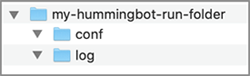

# Installing Hummingbot

## Option 1: Run `hummingbot` using Docker

Using a pre-compiled version of `hummingbot` from Docker allows you to run `hummingbot` using a single line command.

Docker images of `hummingbot` are available on Docker Hub at [coinalpha/hummingbot](https://cloud.docker.com/u/coinalpha/repository/docker/coinalpha/hummingbot).

!!! warning "Alpha Testers"
    The `hummingbot` docker image is currently only available to alpha testers.  If you are an alpha tester and would like access, please contact us on [`hummingbot` Discord](https://discord.hummingbot.io) or email [contact@hummingbot.io](mailto:contact@hummingbot.io).


### Create new instance of `hummingbot`


``` bash tab="Terminal: Start hummingbot with Docker"
docker run -it \
--name $NAME \
-v "$PWD"/conf/:/conf/ \
-v "$PWD"/logs/:/logs/ \
coinalpha/hummingbot:$TAG
```

!!! note "Command Variables"
    Replace `$TAG` with the image version, such as `latest`, and `$NAME` with a label you choose, such as 'WETH-USDC'

---

### Config and log files

When creating the instance for the first time, the `docker run` command above will create two new folders on your computer and mount them to your instance:

- `conf/`: where configuration files will be stored
- `log/`: where logs will be stored



!!! info "Mounting Existing `config` and `log` Folders"
    If you have existing `conf/` and `log/` folders, running the command above will mount the existing `conf/` and `log/` folders to the newly created docker container instance and allow you to continue using those files.

### Reference: useful Docker commands

Command | Description
---|---
`docker ps` | List existing, running containers
`docker start $NAME` | Start an existing, previously created container
`docker attach $NAME` | Connect to an existing, running container

#### Update Hummingbot Version

The following command will update an existing instance of `hummingbot` with a new, specified version:

```bash
docker rm $NAME && \
docker image rm coinalpha/hummingbot:$OLD_TAG && \
docker run -it \
--name $NAME \
-v "$PWD"/conf/:/conf/ \
-v "$PWD"/logs/:/logs/ \
coinalpha/hummingbot:$NEW_TAG
```

---

## Option 2: Install from source

### OS-specific dependencies

We provide users with binaries compiled for each operating systems. Below, we list OS-specific dependencies and suggestions.

OS | Notes
---|---
**Mac OSX** | You may need to install [Xcode](https://developer.apple.com/xcode/) or Xcode command line tools.
**Linux** | We recommend Ubuntu 18.04, though Hummingbot should work on other version of Linux as well. If you are installing Hummingbot on a fresh Linux virtual machine, we recommend installing the `build-essential` package beforehand, since Hummingbot uses the `gcc` compiler and other libraries it contains: <br/><br/> ```sudo apt install build-essential```
**Windows** | Hummingbot is designed and optimized for Mac OS X and Linux. While a Windows binary is available, it is not actively supported. Instead, we recommend that Windows users install [Windows Subsystem for Linux](https://docs.microsoft.com/en-us/windows/wsl/faq), which allows you to run the Linux version.

### 1. Install Anaconda

Hummingbot requires Python 3 and other Python libraries. To manage these dependencies, Hummingbot uses Anaconda, an open source environment and package manager for Python that is the current industry standard for data scientists and data engineers.

To install Anaconda, go to [the Anaconda site](https://www.anaconda.com/distribution/) and download the **Python 3.7 installer** for your operating system. Both the graphical installer and the command line installer will work. Run the installer, and it will guide you through the installation process.

Afterwards, open a Terminal window and try the `conda` command. If the command is valid, then Anaconda has been successfully installed, even if the graphical installer says that it failed.

!!! warning
    If you use ZSH or another Unix shell, copy the code snippet below to your `.zshrc` or similar file. By default, Anaconda only adds it to your `.bash_profile` file. This makes the `conda` command available in your root path.

```bash
__conda_setup="$(CONDA_REPORT_ERRORS=false '/anaconda3/bin/conda' shell.bash hook 2> /dev/null)"
if [ $? -eq 0 ]; then
    \eval "$__conda_setup"
else
    if [ -f "/anaconda3/etc/profile.d/conda.sh" ]; then
        . "/anaconda3/etc/profile.d/conda.sh"
        CONDA_CHANGEPS1=false conda activate base
    else
        \export PATH="/anaconda3/bin:$PATH"
    fi
fi
unset __conda_setup
```

### 2. Download the Hummingbot client

During the private alpha program, we will provide alpha program participants with a zip archive that contains compiled binaries of the Hummingbot source code for each supported operating system (OS X, Linux), since we are in the process of removing proprietary code from the Hummingbot code base. 

When we open source Hummingbot at the end of March 2019, the source code will be generally available on GitHub and we will publish additional instructions for users who wish to install from source.

### 3. Run install script

After unzipping the zip archive, open a Terminal window and go to the unzipped directory:

```
cd hummingbot-dist
```

Afterwards, run the install script, which creates a custom Anaconda environment and installs the Python libraries and other dependencies needed by the bot:

```
./install
```

### 4. Activate environment

The installation script creates a custom Anaconda environment that manages dependencies used by Hummingbot. Activate the environment:

```
conda activate hummingbot-dist
```
The environment has been activated when you see a `(hummingbot-dist)` prefix before your Terminal command prompt:

<hr />

# Next: [Start the Hummingbot client](/client)
