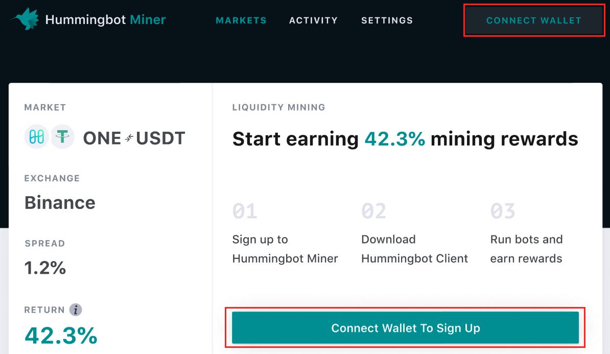
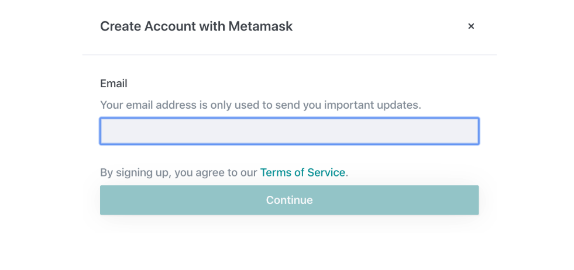
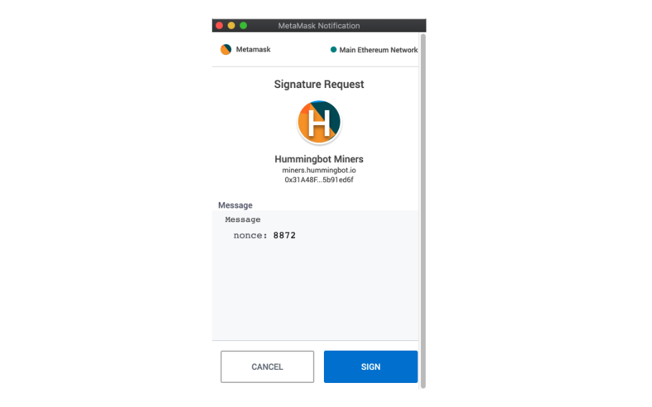

# Step 1: Sign Up

<iframe width="616" height="347" src="https://www.youtube.com/embed/c08QTUVG0AE"    frameborder="0" allow="accelerometer; autoplay; encrypted-media; gyroscope; picture-in-picture" allowfullscreen>
</iframe>

## 1a. Connect Ethereum wallet

Go to the [Hummingbot Miner](https://miners.hummingbot.io/) web app.

Click the **Connect Wallet** button to register using your Ethereum wallet. We use the Ethereum blockchain to instantaneously transmit weekly payments to anyone in the world.

*(To find out more, click here: [FAQ: Why do I need to connect my wallet?](/liquidity-mining/faq/#why-do-i-need-to-connect-my-wallet))*

<small><em>Note: figures above are for illustration only and do not represent current campaign terms; navigate to [Hummingbot Miners](https://miners.hummingbot.io) for current campaign details.</em></small>

Note that this may require you to install the Metamask browser extension (see note below).

!!! note "Metamask"
    [Metamask](https://metamask.io/) is the leading browser extension for Ethereum. It helps you interact with Ethereum dApps in your browser without running a full Ethereum node.

---

## 1b. Agree to terms & conditions

Next, read the liquidity mining [terms and conditions](https://hummingbot.io/liquidity-mining-policy/) and submit your email address to confirm agreement.

We send miners a weekly email with a detailed breakdown of their earnings for the past weekly period.

---

## 1c. Complete sign-up

After submitting your email, authorize your signature on MetaMask:

This uses your Ethereum address's private key to securely sign an Ethereum transaction that completes the signup process. Your private key is never exposed to us or any other third party when you sign a transaction.

---

# Next: [Step 2: Connect Exchanges](2-connect-exchanges.md)