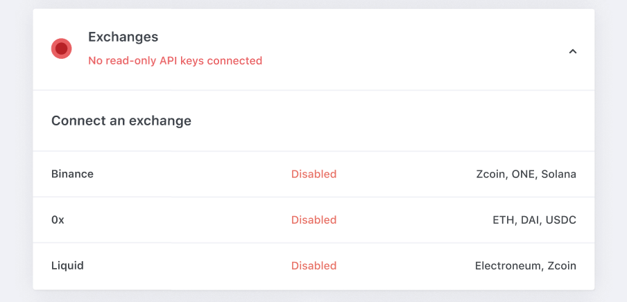
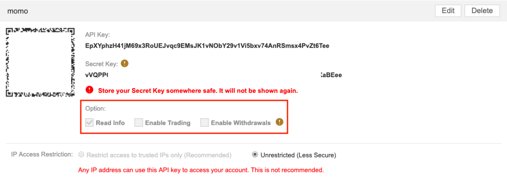
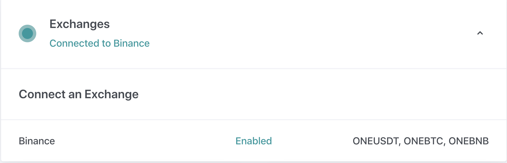

# Step 2: Connect Exchanges

In order to accurately allocate rewards, we need to separate individual miner orders from one another. To do this, we require you to enter read-only API keys for each exchange where you wish to earn rewards.

---

## 2a. Go to the Settings tab

On the dashboard, click on **Settings** to enter your exchange information.

<small><em>Note: figures above are for illustration only and do not represent current campaign terms; navigate to [Hummingbot Miners](https://miners.hummingbot.io) for current campaign details.</em></small>

---

## 2b. Enter read-only API key for each exchange

Click on an exchange to enter the API key information:

Enter your read-only API key for the selected exchanges. Note that the required inputs for each exchange may be different.

!!! tip "Creating API keys"
    Please see this [section](https://docs.hummingbot.io/installation/api-keys/) in the Hummingbot User Manual for instructions on how to create API keys for each exchange.

We only need **read-only access**, so you can disable the trade and withdrawal functionality (see example below for Binance)

 

---

## 2c. Confirm successful connection

After you enter your read-only API key, we check that the submitted API key is valid. If it is valid, you will see a confirmation message that your exchange account has successfully been connected.

  

---

# Next: [Step 3: Run Hummingbot](3-run-bot.md)