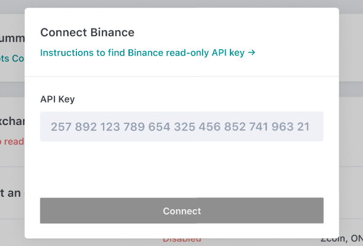

# Participation Guide

!!! info "Not Investment, Financial, Legal, or Tax Advice"
    The content of this Site does not constitute investment, financial, legal, or tax advice. None of the information contained on this Site constitutes a recommendation, solicitation, or offer to buy or sell any digital assets, securities, options, or other financial instruments or other assets, or to provide any investment advice or service. 
    **Please review the [Liquidity Mining Policy](https://hummingbot.io/liquidity-mining-policy/) for the full disclaimer.**

## Timeline

This liquidity mining program will run for 12 weeks starting in early February 2020.

## Rewards

Liquidity miners can earn rewards based on a formula that takes into account duration and consistency of orders placed over time, spreads, and sizes. You'll be able to check your earned rewards by minute, and your total earned balance in the Activity section. 

## How to Participate

1. Sign up for the program on the [liquidity mining web APP](https://miners.hummingbot.io/) by connecting your wallet.
 
2. Once your wallet is connected, fill out your email.
  
3. To complete the signup, authorize your signature on MetaMask. 
  
4. You can see the available markets and go to **settings** to set up your exchange information.
  
You haven't connected to any of the eligible exchanges.
  
5. Fill out your **read-only** API key. (See [How to get API keys?](https://docs.hummingbot.io/installation/api-keys/))  
  
The API you provide only needs to enable "read info". 
 
6. Now you have been connected to one of the eligible exchanges.
  
7. Start market making for any eligible trading pair and Earn rewards! 😎 

!!! note 
    If you want to participate using Hummingbot, you can [download Hummingbot](https://hummingbot.io/download) on the website, or follow the [Quickstart Guide](/quickstart/) to install and configure Hummingbot. Configure and run a bot that uses either the [**pure market making**](/strategies/pure-market-making) or the [**cross-exchange market making**](/strategies/cross-exchange-market-making) strategy within or across eligible exchanges.

## Updates and Announcements

We send out updates and announcements through our [Discord channel](https://discord.hummingbot.io), [Twitter](https://twitter.com/hummingbot_io), and [bi-weekly newsletters](http://hummingbot.substack.com). 

You can also read through the articles in our [blog](https://hummingbot.io/blog/tag/liquidity-mining#tags) where you can find useful information about liquidity mining such as statistics, AMA, interviews from our top liquidity miners, previous month recap, and more.

## Performance

Check your performance in the real-time Activity section within our liquidity mining app. 

## Evaluation

Once the program officially kicks off, the rewards will be paid out **weekly** in USDC based on the **actual trading activity** of the participants. 

!!! Tip
    The rewards will be automatically calculated based on your trading activities for eligible pairs collected through the exchange APIs you provide. Please check each individual campaign page for specific terms, conditions, and eligibility information. 

All rewards will be subject to the sole discretion of the token issuer and/or the Hummingbot team.

## More Resources

- [Liquidity Mining FAQs](/liquidity-mining/faq/)
- [Hummingbot Quickstart Guide](/quickstart/)

---
## Important Disclaimer

Participating users must agree to the [Liquidity Mining Program Terms and Conditions](https://hummingbot.io/liquidity-mining-policy/).