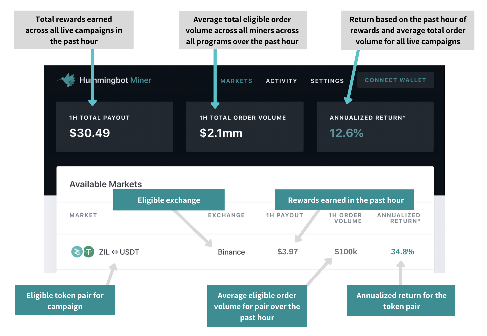
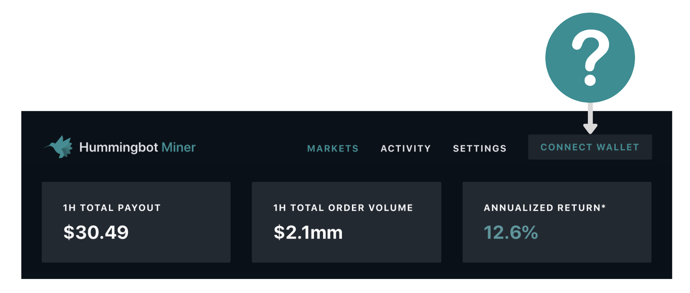

# Liquidity Mining Overview

!!! info "Important Disclaimer"
    <small><ul><li>The content of this Site does not constitute investment, financial, legal, or tax advice, nor does any of the information contained on this Site constitute a recommendation, solicitation, or offer to buy or sell any digital assets, securities, options, or other financial instruments or other assets, or to provide any investment advice or service.<li>There is no guarantee of profit for participating in liquidity mining.<li>Participation is subject to eligiblity requirements.</ul></small>
    **Please review the [Liquidity Mining Policy](https://hummingbot.io/liquidity-mining-policy/) for the full disclaimer.**

## Overview
Liquidity mining is a community-based, data-driven approach to market making, in which a token issuer or exchange can reward a pool of miners to provide liquidity for a specified token.

Liquidity mining sets forth an analytical framework for determining market maker compensation based on (1) time (order book consistency), (2) order spreads, and (3) order sizes, in order to create a fair model for compensation that aligns a miner's risk with rewards.

## Key dates

During the **open beta**, we track real exchange order books for real user-submitted orders, but we pay testnet Ethereum token rewards (no value). After the commencement of **production launch**, we will pay mainnet Ethereum token rewards.

* **Open beta**: 12:00am February 4, 2020 UTC time
* **Production launch**: *(subject to change)* 12:00am March 3, 2020 UTC time

## Getting started
- [Website](https://hummingbot.io/liquidity-mining): home page for Liquidity Mining
- [Setup Guide](/liquidity-mining/guide): Start earning liquidity rewards in 5 minutes
- [FAQ](/liquidity-mining/faq): frequently asked questions about Liquidity Mining
- [Campaigns](/liquidity-mining/campaigns): information about active liquidity mining campaigns

## Support and announcements
* [Discord](https://discord.hummingbot.io): 24/7 support and chat
* [Twitter](https://twitter.com/hummingbot_io): Official announcements
* [Newsletter](http://hummingbot.substack.com): Get the official Hummingbot bi-weekly email newsletter

## Additional resources
- [Whitepaper](https://hummingbot.io/liquidity-mining.pdf)
- [Announcement blog post](https://hummingbot.io/blog/2019-11-liquidity-mining/)
- [How rewards are calculated](https://hummingbot.io/blog/2019-12-liquidity-mining-rewards/)

## Hummingbot Miner

[Hummingbot Miner](https://miners.hummingbot.io/) is the **official Liquidity Mining app** where users can get real-time information on liquidity mining campaigns.

Use Hummingbot Miner to sign up for liquidity mining, connect the app to your exchange accounts to enable rewards, and track your liquidity mining activity and earnings. **Note that you will still need to run Hummingbot or another market making bot in order to earn liquidity mining rewards.**

!!! note "Mobile support"
    Currently, Hummingbot Miner is only optimized for desktop/laptop devices. We plan to add mobile/tablet support shortly.

### What are the tabs on the dashboard?

Tab | Description
---|---
**Markets** | Displays the currently available liquidity mining campaigns: eligible token pairs, exchanges, and recent participation and reward metrics
**Activity** | Displays a miner's currently accrued rewards, recent history of rewards earned, as well as payout history.
**Settings** | Configuration tab for setting up exchange APIs to enable participation in liquidity mining campaigns.

### What do the figures on the Markets tab mean?

The figures on the Markets tab show a summary of aggregated data across all campaigns and across all miners, as well as aggregated data for each token pair.

<small><em>Note: figures above are for illustration only and do not represent current campaign terms; navigate to [Hummingbot Miners](https://miners.hummingbot.io) for current campaign details.</em></small>

### Why do I need to connect my wallet?

<small><em>Note: figures above are for illustration only and do not represent current campaign terms; navigate to [Hummingbot Miners](https://miners.hummingbot.io) for current campaign details.</em></small>

The Hummingbot Miners app uses your Ethereum wallet address for:

1. **assigning you a unique user ID**.  The Hummingbot miners app associates your configurations (e.g. email address, API configurations), as well as activity.  This allows the miners app to display your user-specific information such as rewards earned and payout history.
2. **payouts**: mining rewards payouts will be sent to this address

!!! note "Wallet not used for trading"
    Since it is only used for the purposes mentioned above, you do not need deposit assets into or trade using this wallet.
