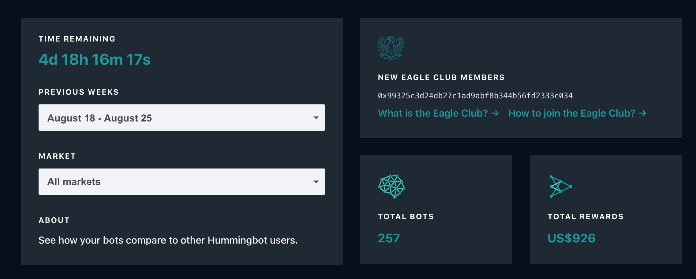

# About Leaderboard

Leaderboard allows you to track and compare your rewards against the rest of the miners, check the current/previous campaign statistics. 

The following screenshot displays the leaderboard pane.

**Total Bots** displays the current total number of bots currently participating in liquidity mining 

**Total Rewards** displays the current total rewards for all miners

Eagle Club Members:
* [What is the Eagle Club](https://www.notion.so/hummingbot/Eagle-Club-introduction-df2f9d0aaeeb48608b7b93dc60a8d620)
* [How to join the Eagle Club](https://www.notion.so/hummingbot/How-can-I-become-a-member-73a3675ca13c46b1bb671652d4c43219)

The following screenshot displays the leaderboard ranking.

By default, the Ethereum address is displayed as the username. You can change the username by going to the [Settings](settings.md) page. 

