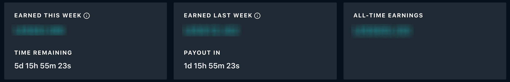
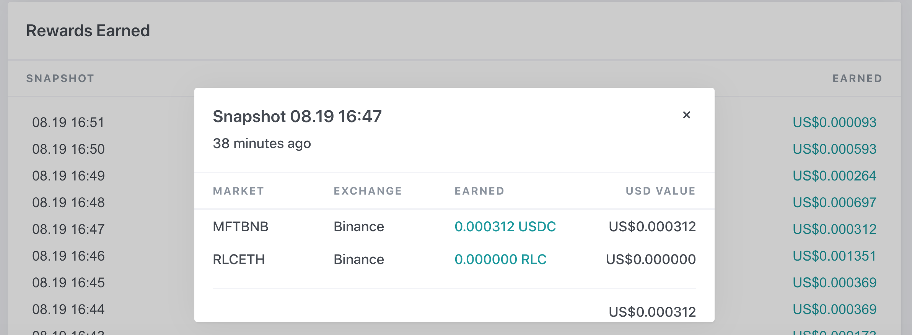

# About Rewards

When you first log into Miner App, **Rewards** page is displayed. The **Rewards** page allows to check your:

* Rewards Summary
* Latest Earnings
* Snapshots Rewards per min

## Rewards Summary

The following screenshot displays the rewards summary.

**EARNED THIS WEEK** is the current amount that you have earned for the current week. A timer counter displays the time remaining for the week.

**Earn Last Week** is the total amount that you have earned last week, and displays the payout timer. The payout is paid three days after the end of week.

**All-TIME EARNINGS** Displays your all time earnings.

To know more about your payouts, click **Payouts** tab. For details, see [Payout](payouts.md)

## Latest Earnings

The following screenshot displays the latest earnings in chart format, and you can select 1hr, 24hr or 7D to check on your earnings.

If you have mulitple bots running and participating in liquidity mining, each miner will be represented by a different color. Move your cursor over the graph and a pop-up box is displayed with the individual miner bot rewards per snapshot by the min.

## Snapshots Rewards Per Min

In each weekly epoch, the lump-sum weekly reward is distributed equally across each minute within that epoch. For each minute, a random snapshot is taken from within that minute to be used for calculating reward allocations.

For each snapshot, half the reward is allocated to the bid-side of the order book, and the other half is allocated to the ask side of the order book. We mandate this 50/50 split in order to deter participants from using our system to manipulate price in one direction or another. If there are no eligible orders submitted for a specific snapshot, the amount of rewards allocated for that snapshot will roll over and be added to the reward amount for the subsequent snapshot.

!!! note "Earning rewards in mulitple markets"
    You can run different instances of Hummingbot or your own software to earn rewards in multiple markets simultaneously. And the reward allocations for each market are calculated independently, so your earnings in one market won't affect other markets. 

To know more on how the rewards are calculated, see[Liquidity mining rewards calculation](https://www.notion.so/hummingbot/Liquidity-mining-rewards-calculation-c838aeefda274ada9976e04a2958d5e6)

## Checking Snapshot Rewards Per Min

The Snapshot view in Hummingbot Miner contains a breakdown of how the per-minute reward for a single market is allocated.

To check:

1. Scroll down to **Rewards Earned** section.
2. Select and click on the desired snapshot. The snapshot pop-up box is displayed.

**Note** Only the last 15 snapshots are avaliable. If you need to check the earlier snapshots, you have to use the prior snapshot in markets, see article "checking campaign details and rewards per snapshot" in[markets](markets.md) but it's limited to indiviual market pair.

For frequently asked questions about the rewards, click [Help Center](https://www.notion.so/hummingbot/Help-Center-aa042efc10a5494aa745576722c7924b)
