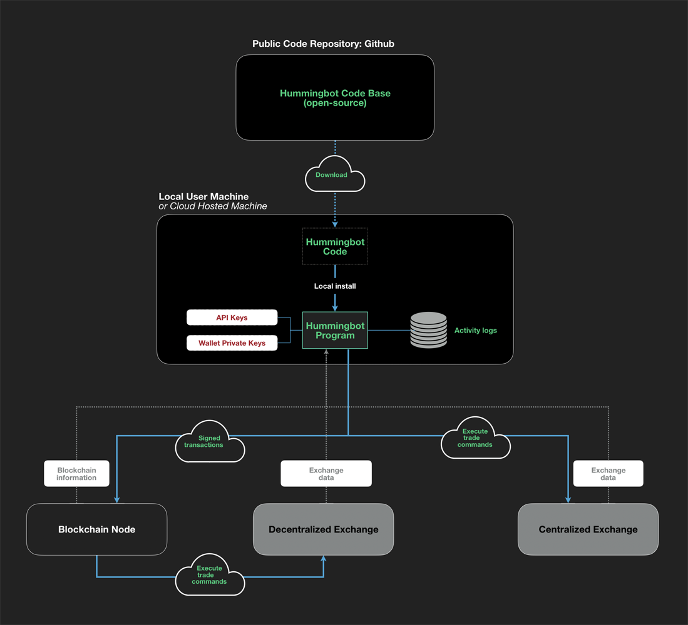

# Hummingbot Whitepaper

### You can access our full whitepaper [here](https://www.hummingbot.io/whitepaper.pdf).

## Litepaper

Below, we provide a high-level summary of the whitepaper. The link is above, and we highly recommend you read it if you are interested in using Hummingbot.

### Motivation

Proponents of tokenization, the process of creating a digital asset transferrable on a public
distributed ledger, espouse its ability to unlock the liquidity premium in asset classes such as startups, real estate, and private equity. Yet in practice, tokenization has led to extreme concentration of liquidity. The top three digital assets have a combined daily exchange trading volume of $12 billion, 72% of total daily exchange trading volume, and of the more than 2,000 crypto assets listed in [CoinMarketCap](https://coinmarketcap.com), 92% have less than $1 million in daily volume.

While tokenization enables assets to trade freely, it does not automatically confer liquidity onto them. In order for the global financial system to fully realize the value of tokenization, there needs to be sufficient actors who are both incentivized and equipped to provide liquidity, especially for the long tail of tokenized assets.

### Market Making

Providers of liquidity on financial markets are called ==market makers==. Market makers play a fundamental role in asset markets by simultaneously quoting bid (offers to buy) and ask (offers to sell) prices for assets on an exchange. By quoting prices at which they stand ready to buy and sell assets, they enable price discovery and liquid trading by other market participants. In addition, by quoting prices on different trading venues and arbitraging away inter-market dislocations across different markets, market makers increase overall market efficiency.

Unlike in fiat markets, ==direct market access== in digital markets enables individual traders to provide price quotes and execute trades programmatically using the same APIs as professional firms. Digital asset exchanges also provide market data feeds free of charge and generally do not offer co-location or other features that provide significant competitive advantages to large players at the expense of smaller ones.

However, technical barriers prevent additional entrants from making markets for digital assets. Due to the highly volatile nature of digital asset prices, market makers need to utilize an automated, algorithmic approach in order to stay competitive. Unlike in fiat markets where the Financial Information exchange (FIX) Protocol provides a standardized message format for electronic trading, digital asset exchange APIs vary in both format and reliability. Market making algorithms need to handle edge cases such as stale data, trade execution lag, and API downtime. Writing robust, reliable market making algorithms that can trade on multiple exchanges requires significant specialized engineering resources.

### The Hummingbot Client

We introduce Hummingbot, an open source software client that allows users to create and customize automated, algorithmic trading bots for making markets on both centralized and decentralized digital asset exchanges. By lowering these technical barriers and introducing new incentive mechanisms, we enable anyone to act as a market maker for digital assets, a new model for liquidity provision that we call ==decentralized market making==.

Since Hummingbot needs to access sensitive digital asset private keys and exchange API keys to operate automatically, we design it as a user-operated local or hosted client, similar to a cryptocurrency mining node. By encapsulating market making algorithms and a trade execution engine in an open-source application available to non-technical users, Hummingbot enables a much wider range of individuals and companies to potentially earn income from running market maker nodes that provide liquidity to crypto-asset pairs that trade on various exchanges.

Hummingbot will effectively be a trading engine to execute transactions with the parameters provided by users, abstracting some the technical complexities of transacting with centralized and decentralized exchanges, each with their own non-standardized technical specifications. Hummingbot will facilitate trade execution and interaction with different exchanges, performing actions such as price and order book retrieval, submission of trade instructions, and, if specified by the user, handle asset transfers for functions such as rebalancing across different exchange accounts.

